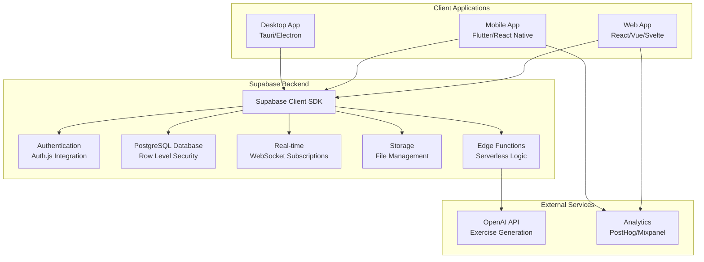
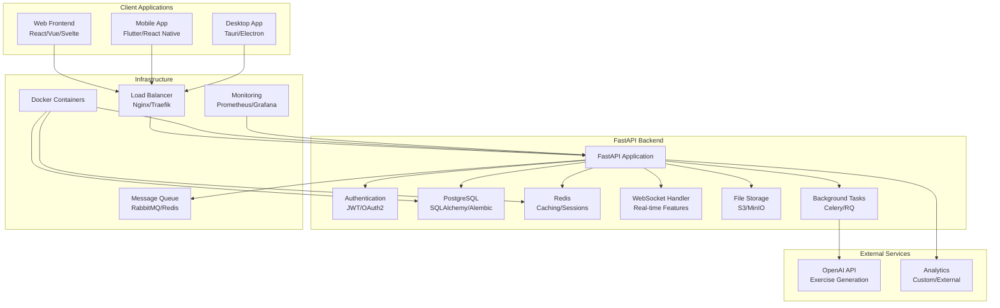

# Supabase vs FastAPI Architecture Analysis
## Spanish Subjunctive Practice Application

### Executive Summary

This document provides a comprehensive architectural analysis comparing Supabase (Backend-as-a-Service) and FastAPI (custom backend) solutions for the Spanish Subjunctive Practice Application. Based on analysis of the existing PyQt desktop application, we evaluate both approaches across development speed, scalability, flexibility, and feature requirements.

## Current Application Architecture Analysis

### Existing Desktop Application Structure
```
Current Architecture (PyQt Desktop)
├── main.py (3,800+ lines) - Monolithic UI application
├── session_manager.py - Local session tracking
├── learning_analytics.py - Progress analytics
├── tblt_scenarios.py - Exercise generation
├── conjugation_reference.py - Grammar rules
└── config/
    ├── accessibility_settings.json
    └── user_preferences.json
```

### Key Data Models Identified
1. **User Sessions** - Practice tracking, streaks, statistics
2. **Exercise Generation** - TBLT scenarios, conjugation patterns
3. **Learning Analytics** - Error analysis, adaptive difficulty
4. **User Preferences** - Accessibility, personalization settings
5. **Progress Tracking** - Mastery levels, review queues

### Current Limitations
- Desktop-only (no web/mobile)
- Local storage only (no cloud sync)
- No user authentication
- No collaborative features
- Limited scalability
- Single-user experience

## Architecture Comparison Overview

| Factor | Supabase (BaaS) | FastAPI (Custom) |
|--------|----------------|------------------|
| **Development Speed** | ⭐⭐⭐⭐⭐ Very Fast | ⭐⭐⭐ Moderate |
| **Initial Complexity** | ⭐⭐ Low | ⭐⭐⭐⭐ High |
| **Long-term Flexibility** | ⭐⭐⭐ Good | ⭐⭐⭐⭐⭐ Excellent |
| **Real-time Features** | ⭐⭐⭐⭐⭐ Built-in | ⭐⭐⭐ Manual Setup |
| **Authentication** | ⭐⭐⭐⭐⭐ Complete | ⭐⭐⭐ Custom Build |
| **Vendor Lock-in** | ⭐⭐ High | ⭐⭐⭐⭐⭐ None |
| **Performance Control** | ⭐⭐⭐ Limited | ⭐⭐⭐⭐⭐ Full Control |
| **Cost (Scale)** | ⭐⭐⭐ Variable | ⭐⭐⭐⭐ Predictable |

## Detailed Architecture Designs

### 1. Supabase Architecture



### 2. FastAPI Architecture



## Feature-by-Feature Analysis

### 1. Authentication & User Management

#### Supabase Approach ⭐⭐⭐⭐⭐
- **Built-in Auth**: Complete OAuth2, magic links, social providers
- **User Management**: Dashboard, user metadata, custom claims
- **Security**: Automatic JWT handling, secure-by-default
- **Features**: Email verification, password reset, MFA support

#### FastAPI Approach ⭐⭐⭐
- **Custom Implementation**: JWT tokens, OAuth2 flows
- **User Management**: Custom admin interface required
- **Security**: Manual security implementation needed
- **Features**: All features possible but require development

### 2. Database & Data Management

#### Supabase Approach ⭐⭐⭐⭐
- **PostgreSQL**: Full PostgreSQL with PostGIS, full-text search
- **Row Level Security**: Built-in multi-tenant security
- **Auto-generated APIs**: Automatic REST & GraphQL APIs
- **Migrations**: Built-in migration system
- **Real-time**: Automatic change streaming

#### FastAPI Approach ⭐⭐⭐⭐⭐
- **Database Choice**: Any database (PostgreSQL, MySQL, MongoDB)
- **ORM Flexibility**: SQLAlchemy, Tortoise ORM, or raw SQL
- **Custom Queries**: Full control over complex queries
- **Migrations**: Alembic or custom migration system
- **Performance**: Fine-tuned query optimization

### 3. Real-time Features

#### Supabase Approach ⭐⭐⭐⭐⭐
- **Built-in Subscriptions**: Automatic WebSocket connections
- **Database Changes**: Live updates from database changes
- **Presence**: Built-in user presence tracking
- **Broadcast**: Custom real-time events

#### FastAPI Approach ⭐⭐⭐
- **WebSocket Support**: Built-in WebSocket support
- **Custom Implementation**: Manual real-time feature development
- **State Management**: Custom state synchronization
- **Scalability**: Requires Redis for multi-instance scaling

### 4. File Storage & Media

#### Supabase Approach ⭐⭐⭐⭐
- **Built-in Storage**: S3-compatible storage with CDN
- **Access Control**: RLS policies for file access
- **Image Optimization**: Automatic image transformations
- **Easy Integration**: Direct SDK integration

#### FastAPI Approach ⭐⭐⭐⭐
- **Storage Choice**: S3, MinIO, local storage, or cloud providers
- **Custom Logic**: Full control over file processing
- **CDN Integration**: Manual CDN setup required
- **Flexibility**: Support for any storage backend

### 5. Edge Functions & Custom Logic

#### Supabase Approach ⭐⭐⭐⭐
- **Serverless Functions**: Deno-based edge functions
- **Database Integration**: Direct database access
- **Triggers**: Database triggers and webhooks
- **Limitations**: Deno runtime, cold starts

#### FastAPI Approach ⭐⭐⭐⭐⭐
- **Full Python**: Complete Python ecosystem
- **Background Jobs**: Celery, RQ, or asyncio tasks
- **Custom Integrations**: Any third-party service
- **Performance**: Optimized for specific use cases

## Code Examples

### Supabase Implementation Examples

#### 1. User Progress Tracking with RLS
```sql
-- Database Schema with Row Level Security
CREATE TABLE user_progress (
  id UUID PRIMARY KEY DEFAULT gen_random_uuid(),
  user_id UUID REFERENCES auth.users(id) ON DELETE CASCADE,
  exercise_type VARCHAR(50) NOT NULL,
  correct_answers INTEGER DEFAULT 0,
  total_attempts INTEGER DEFAULT 0,
  streak_count INTEGER DEFAULT 0,
  difficulty_level INTEGER DEFAULT 1,
  last_practiced TIMESTAMPTZ DEFAULT NOW(),
  mastered_topics JSONB DEFAULT '[]'::jsonb,
  created_at TIMESTAMPTZ DEFAULT NOW(),
  updated_at TIMESTAMPTZ DEFAULT NOW()
);

-- Row Level Security Policy
ALTER TABLE user_progress ENABLE ROW LEVEL SECURITY;

CREATE POLICY "Users can only access their own progress"
  ON user_progress
  FOR ALL
  USING (auth.uid() = user_id)
  WITH CHECK (auth.uid() = user_id);

-- Real-time subscription for progress updates
CREATE OR REPLACE FUNCTION notify_progress_change()
RETURNS TRIGGER AS $$
BEGIN
  -- Notify real-time subscribers of progress changes
  PERFORM pg_notify('progress_change', json_build_object(
    'user_id', NEW.user_id,
    'exercise_type', NEW.exercise_type,
    'streak_count', NEW.streak_count
  )::text);
  RETURN NEW;
END;
$$ LANGUAGE plpgsql;

CREATE TRIGGER progress_change_trigger
  AFTER INSERT OR UPDATE ON user_progress
  FOR EACH ROW EXECUTE FUNCTION notify_progress_change();
```

#### 2. React Frontend with Supabase
```typescript
// supabase.ts - Supabase client configuration
import { createClient } from '@supabase/supabase-js'

const supabaseUrl = 'https://your-project.supabase.co'
const supabaseKey = 'your-anon-key'

export const supabase = createClient(supabaseUrl, supabaseKey)

// types/database.types.ts - Generated types
export interface UserProgress {
  id: string
  user_id: string
  exercise_type: string
  correct_answers: number
  total_attempts: number
  streak_count: number
  difficulty_level: number
  last_practiced: string
  mastered_topics: string[]
  created_at: string
  updated_at: string
}

// hooks/useProgress.ts - React hook for progress management
import { useState, useEffect } from 'react'
import { supabase } from '../supabase'
import type { UserProgress } from '../types/database.types'

export const useProgress = (userId: string) => {
  const [progress, setProgress] = useState<UserProgress[]>([])
  const [loading, setLoading] = useState(true)
  const [error, setError] = useState<string | null>(null)

  useEffect(() => {
    // Fetch initial progress data
    const fetchProgress = async () => {
      try {
        const { data, error } = await supabase
          .from('user_progress')
          .select('*')
          .eq('user_id', userId)
          .order('last_practiced', { ascending: false })

        if (error) throw error
        setProgress(data || [])
      } catch (err) {
        setError(err instanceof Error ? err.message : 'Unknown error')
      } finally {
        setLoading(false)
      }
    }

    fetchProgress()

    // Set up real-time subscription
    const subscription = supabase
      .channel('progress_changes')
      .on('postgres_changes', {
        event: '*',
        schema: 'public',
        table: 'user_progress',
        filter: `user_id=eq.${userId}`
      }, (payload) => {
        if (payload.eventType === 'INSERT') {
          setProgress(prev => [payload.new as UserProgress, ...prev])
        } else if (payload.eventType === 'UPDATE') {
          setProgress(prev => prev.map(item => 
            item.id === payload.new.id ? payload.new as UserProgress : item
          ))
        } else if (payload.eventType === 'DELETE') {
          setProgress(prev => prev.filter(item => item.id !== payload.old.id))
        }
      })
      .subscribe()

    return () => {
      subscription.unsubscribe()
    }
  }, [userId])

  const updateProgress = async (exerciseType: string, isCorrect: boolean) => {
    try {
      // Use Supabase RPC for complex progress calculation
      const { data, error } = await supabase.rpc('update_user_progress', {
        p_user_id: userId,
        p_exercise_type: exerciseType,
        p_is_correct: isCorrect
      })

      if (error) throw error
      return data
    } catch (err) {
      setError(err instanceof Error ? err.message : 'Failed to update progress')
      throw err
    }
  }

  return { progress, loading, error, updateProgress }
}

// components/ProgressDashboard.tsx - Real-time progress component
import React from 'react'
import { useAuth } from '../hooks/useAuth'
import { useProgress } from '../hooks/useProgress'

export const ProgressDashboard: React.FC = () => {
  const { user } = useAuth()
  const { progress, loading, error, updateProgress } = useProgress(user?.id || '')

  if (loading) return <div>Loading progress...</div>
  if (error) return <div>Error: {error}</div>

  const totalExercises = progress.reduce((sum, p) => sum + p.total_attempts, 0)
  const totalCorrect = progress.reduce((sum, p) => sum + p.correct_answers, 0)
  const accuracy = totalExercises > 0 ? (totalCorrect / totalExercises) * 100 : 0

  return (
    <div className="progress-dashboard">
      <h2>Your Progress</h2>
      <div className="stats-grid">
        <div className="stat-card">
          <h3>Total Exercises</h3>
          <p>{totalExercises}</p>
        </div>
        <div className="stat-card">
          <h3>Accuracy</h3>
          <p>{accuracy.toFixed(1)}%</p>
        </div>
        <div className="stat-card">
          <h3>Current Streak</h3>
          <p>{Math.max(...progress.map(p => p.streak_count), 0)} days</p>
        </div>
      </div>
      
      <div className="exercise-types">
        {progress.map(p => (
          <div key={p.id} className="exercise-type-card">
            <h4>{p.exercise_type}</h4>
            <div className="progress-bar">
              <div 
                className="progress-fill" 
                style={{ 
                  width: `${(p.correct_answers / p.total_attempts) * 100}%` 
                }}
              />
            </div>
            <p>{p.correct_answers}/{p.total_attempts} correct</p>
            <p>Difficulty Level: {p.difficulty_level}</p>
          </div>
        ))}
      </div>
    </div>
  )
}
```

#### 3. Edge Function for Exercise Generation
```typescript
// supabase/functions/generate-exercise/index.ts
import { serve } from "https://deno.land/std@0.168.0/http/server.ts"
import { createClient } from 'https://esm.sh/@supabase/supabase-js@2'

interface ExerciseRequest {
  user_id: string
  difficulty_level: number
  exercise_type: string
  weak_areas?: string[]
}

interface ExerciseResponse {
  sentence: string
  context: string
  correct_answer: string
  distractors: string[]
  explanation: string
  difficulty: number
}

serve(async (req) => {
  try {
    // Initialize Supabase client with service role key
    const supabaseUrl = Deno.env.get('SUPABASE_URL')!
    const supabaseKey = Deno.env.get('SUPABASE_SERVICE_ROLE_KEY')!
    const supabase = createClient(supabaseUrl, supabaseKey)

    const { user_id, difficulty_level, exercise_type, weak_areas }: ExerciseRequest = await req.json()

    // Get user's learning history from database
    const { data: userHistory } = await supabase
      .from('user_progress')
      .select('*')
      .eq('user_id', user_id)
      .eq('exercise_type', exercise_type)
      .single()

    // Call OpenAI API for personalized exercise generation
    const openAIResponse = await fetch('https://api.openai.com/v1/chat/completions', {
      method: 'POST',
      headers: {
        'Authorization': `Bearer ${Deno.env.get('OPENAI_API_KEY')}`,
        'Content-Type': 'application/json',
      },
      body: JSON.stringify({
        model: 'gpt-4',
        messages: [
          {
            role: 'system',
            content: `Generate a Spanish subjunctive exercise at difficulty level ${difficulty_level}. 
                     Focus on areas where the user struggles: ${weak_areas?.join(', ') || 'general practice'}.
                     User's current accuracy: ${userHistory?.correct_answers || 0}/${userHistory?.total_attempts || 1}`
          },
          {
            role: 'user',
            content: `Create a ${exercise_type} exercise for Spanish subjunctive practice.`
          }
        ],
        max_tokens: 500,
        temperature: 0.7
      })
    })

    const aiResponse = await openAIResponse.json()
    const exerciseContent = JSON.parse(aiResponse.choices[0].message.content)

    // Log the generated exercise
    await supabase
      .from('generated_exercises')
      .insert({
        user_id,
        exercise_type,
        difficulty_level,
        content: exerciseContent,
        ai_model_used: 'gpt-4',
        generated_at: new Date().toISOString()
      })

    const response: ExerciseResponse = {
      sentence: exerciseContent.sentence,
      context: exerciseContent.context,
      correct_answer: exerciseContent.correct_answer,
      distractors: exerciseContent.distractors,
      explanation: exerciseContent.explanation,
      difficulty: difficulty_level
    }

    return new Response(JSON.stringify(response), {
      headers: { 'Content-Type': 'application/json' },
    })

  } catch (error) {
    return new Response(JSON.stringify({ 
      error: error.message 
    }), {
      status: 400,
      headers: { 'Content-Type': 'application/json' },
    })
  }
})
```

### FastAPI Implementation Examples

#### 1. FastAPI Backend Structure
```python
# main.py - FastAPI application entry point
from fastapi import FastAPI, Depends, HTTPException, WebSocket
from fastapi.security import HTTPBearer
from fastapi.middleware.cors import CORSMiddleware
from sqlalchemy.orm import Session
import redis
import asyncio
from typing import List, Optional

from . import models, schemas, auth, database
from .routers import users, exercises, progress, real_time
from .services import ExerciseGenerator, ProgressTracker
from .utils import get_db, get_current_user

app = FastAPI(
    title="Spanish Subjunctive Practice API",
    description="Advanced language learning API with adaptive exercises",
    version="2.0.0"
)

# CORS middleware
app.add_middleware(
    CORSMiddleware,
    allow_origins=["http://localhost:3000", "https://your-app.com"],
    allow_credentials=True,
    allow_methods=["*"],
    allow_headers=["*"],
)

# Redis connection for caching and real-time features
redis_client = redis.Redis(host='localhost', port=6379, decode_responses=True)

# Include routers
app.include_router(users.router, prefix="/api/v1/users", tags=["users"])
app.include_router(exercises.router, prefix="/api/v1/exercises", tags=["exercises"])
app.include_router(progress.router, prefix="/api/v1/progress", tags=["progress"])
app.include_router(real_time.router, prefix="/ws", tags=["websocket"])

# models.py - SQLAlchemy models
from sqlalchemy import Column, Integer, String, Boolean, DateTime, Text, JSON, ForeignKey
from sqlalchemy.ext.declarative import declarative_base
from sqlalchemy.orm import relationship
from sqlalchemy.dialects.postgresql import UUID
import uuid
from datetime import datetime

Base = declarative_base()

class User(Base):
    __tablename__ = "users"
    
    id = Column(UUID(as_uuid=True), primary_key=True, default=uuid.uuid4)
    email = Column(String, unique=True, index=True, nullable=False)
    username = Column(String, unique=True, index=True, nullable=False)
    hashed_password = Column(String, nullable=False)
    is_active = Column(Boolean, default=True)
    is_verified = Column(Boolean, default=False)
    created_at = Column(DateTime, default=datetime.utcnow)
    
    # Relationships
    progress_records = relationship("UserProgress", back_populates="user")
    exercise_sessions = relationship("ExerciseSession", back_populates="user")
    preferences = relationship("UserPreferences", back_populates="user", uselist=False)

class UserProgress(Base):
    __tablename__ = "user_progress"
    
    id = Column(UUID(as_uuid=True), primary_key=True, default=uuid.uuid4)
    user_id = Column(UUID(as_uuid=True), ForeignKey("users.id"), nullable=False)
    exercise_type = Column(String(50), nullable=False)
    correct_answers = Column(Integer, default=0)
    total_attempts = Column(Integer, default=0)
    streak_count = Column(Integer, default=0)
    difficulty_level = Column(Integer, default=1)
    last_practiced = Column(DateTime, default=datetime.utcnow)
    mastered_topics = Column(JSON, default=list)
    weak_areas = Column(JSON, default=list)
    created_at = Column(DateTime, default=datetime.utcnow)
    updated_at = Column(DateTime, default=datetime.utcnow, onupdate=datetime.utcnow)
    
    # Relationships
    user = relationship("User", back_populates="progress_records")

class ExerciseSession(Base):
    __tablename__ = "exercise_sessions"
    
    id = Column(UUID(as_uuid=True), primary_key=True, default=uuid.uuid4)
    user_id = Column(UUID(as_uuid=True), ForeignKey("users.id"), nullable=False)
    session_start = Column(DateTime, default=datetime.utcnow)
    session_end = Column(DateTime, nullable=True)
    exercises_completed = Column(Integer, default=0)
    total_correct = Column(Integer, default=0)
    average_response_time = Column(Integer, nullable=True)  # milliseconds
    session_data = Column(JSON, default=dict)
    
    # Relationships
    user = relationship("User", back_populates="exercise_sessions")
    exercises = relationship("Exercise", back_populates="session")

class Exercise(Base):
    __tablename__ = "exercises"
    
    id = Column(UUID(as_uuid=True), primary_key=True, default=uuid.uuid4)
    session_id = Column(UUID(as_uuid=True), ForeignKey("exercise_sessions.id"))
    exercise_type = Column(String(50), nullable=False)
    sentence = Column(Text, nullable=False)
    context = Column(Text)
    correct_answer = Column(String, nullable=False)
    user_answer = Column(String)
    is_correct = Column(Boolean)
    difficulty_level = Column(Integer)
    response_time_ms = Column(Integer)
    hints_used = Column(Integer, default=0)
    created_at = Column(DateTime, default=datetime.utcnow)
    
    # Relationships
    session = relationship("ExerciseSession", back_populates="exercises")

# schemas.py - Pydantic schemas for API
from pydantic import BaseModel, EmailStr, validator
from typing import List, Dict, Optional, Any
from datetime import datetime
from uuid import UUID

class UserBase(BaseModel):
    email: EmailStr
    username: str

class UserCreate(UserBase):
    password: str
    
    @validator('password')
    def validate_password(cls, v):
        if len(v) < 8:
            raise ValueError('Password must be at least 8 characters long')
        return v

class UserResponse(UserBase):
    id: UUID
    is_active: bool
    is_verified: bool
    created_at: datetime
    
    class Config:
        from_attributes = True

class ProgressUpdate(BaseModel):
    exercise_type: str
    is_correct: bool
    response_time_ms: Optional[int] = None
    hints_used: int = 0

class ProgressResponse(BaseModel):
    id: UUID
    exercise_type: str
    correct_answers: int
    total_attempts: int
    streak_count: int
    difficulty_level: int
    accuracy_rate: float
    last_practiced: datetime
    mastered_topics: List[str]
    weak_areas: List[str]
    
    class Config:
        from_attributes = True

class ExerciseRequest(BaseModel):
    exercise_type: str
    difficulty_level: Optional[int] = None
    focus_areas: Optional[List[str]] = None

class ExerciseResponse(BaseModel):
    id: UUID
    sentence: str
    context: str
    correct_answer: str
    distractors: List[str]
    explanation: str
    difficulty: int
    exercise_type: str

# services/progress_tracker.py - Advanced progress tracking
import asyncio
from typing import Dict, List, Optional
from sqlalchemy.orm import Session
from sqlalchemy import and_, func
from datetime import datetime, timedelta
import numpy as np

from ..models import UserProgress, Exercise, ExerciseSession
from ..utils import get_db

class ProgressTracker:
    """Advanced progress tracking with machine learning insights"""
    
    def __init__(self, db: Session):
        self.db = db
    
    async def update_progress(
        self, 
        user_id: UUID, 
        exercise_type: str, 
        is_correct: bool,
        response_time_ms: Optional[int] = None,
        hints_used: int = 0
    ) -> Dict:
        """Update user progress with advanced analytics"""
        
        # Get or create progress record
        progress = self.db.query(UserProgress).filter(
            and_(
                UserProgress.user_id == user_id,
                UserProgress.exercise_type == exercise_type
            )
        ).first()
        
        if not progress:
            progress = UserProgress(
                user_id=user_id,
                exercise_type=exercise_type
            )
            self.db.add(progress)
        
        # Update basic stats
        progress.total_attempts += 1
        if is_correct:
            progress.correct_answers += 1
            progress.streak_count += 1
        else:
            progress.streak_count = 0
        
        # Calculate accuracy
        accuracy = progress.correct_answers / progress.total_attempts
        
        # Adaptive difficulty adjustment
        if accuracy > 0.85 and progress.total_attempts >= 10:
            progress.difficulty_level = min(progress.difficulty_level + 1, 10)
        elif accuracy < 0.6 and progress.total_attempts >= 5:
            progress.difficulty_level = max(progress.difficulty_level - 1, 1)
        
        # Analyze weak areas based on recent performance
        recent_exercises = self.db.query(Exercise).filter(
            Exercise.session_id.in_(
                self.db.query(ExerciseSession.id).filter(
                    ExerciseSession.user_id == user_id
                )
            )
        ).filter(
            Exercise.created_at >= datetime.utcnow() - timedelta(days=7)
        ).filter(
            Exercise.exercise_type == exercise_type
        ).all()
        
        # Update weak areas based on recent mistakes
        weak_areas = []
        if len(recent_exercises) >= 5:
            error_patterns = {}
            for ex in recent_exercises:
                if not ex.is_correct:
                    # Simple pattern analysis - could be more sophisticated
                    if 'present_subjunctive' in exercise_type and 'irregular' in ex.sentence.lower():
                        error_patterns['irregular_present_subjunctive'] = error_patterns.get('irregular_present_subjunctive', 0) + 1
                    elif 'past_subjunctive' in exercise_type:
                        error_patterns['past_subjunctive'] = error_patterns.get('past_subjunctive', 0) + 1
            
            weak_areas = [pattern for pattern, count in error_patterns.items() if count >= 2]
        
        progress.weak_areas = weak_areas
        progress.last_practiced = datetime.utcnow()
        progress.updated_at = datetime.utcnow()
        
        self.db.commit()
        self.db.refresh(progress)
        
        # Publish real-time update
        await self._publish_progress_update(user_id, progress)
        
        return {
            "progress": progress,
            "accuracy": accuracy,
            "improvement_suggestions": self._get_improvement_suggestions(progress, weak_areas)
        }
    
    async def _publish_progress_update(self, user_id: UUID, progress: UserProgress):
        """Publish progress updates to connected WebSocket clients"""
        from ..routers.real_time import connection_manager
        
        update_data = {
            "type": "progress_update",
            "data": {
                "exercise_type": progress.exercise_type,
                "accuracy": progress.correct_answers / progress.total_attempts,
                "streak_count": progress.streak_count,
                "difficulty_level": progress.difficulty_level,
                "weak_areas": progress.weak_areas
            }
        }
        
        await connection_manager.send_personal_message(str(user_id), update_data)
    
    def _get_improvement_suggestions(self, progress: UserProgress, weak_areas: List[str]) -> List[str]:
        """Generate personalized improvement suggestions"""
        suggestions = []
        
        accuracy = progress.correct_answers / progress.total_attempts
        
        if accuracy < 0.7:
            suggestions.append("Focus on foundational concepts before advancing")
        
        if progress.streak_count == 0 and progress.total_attempts > 5:
            suggestions.append("Review recent mistakes and practice similar exercises")
        
        if 'irregular_present_subjunctive' in weak_areas:
            suggestions.append("Practice irregular verbs in present subjunctive")
        
        if len(weak_areas) > 3:
            suggestions.append("Consider slowing down and focusing on one concept at a time")
        
        return suggestions
```

## Decision Framework

### When to Choose Supabase ⭐⭐⭐⭐⭐

**Ideal Scenarios:**
1. **MVP/Prototype Development** - Need to launch quickly
2. **Small to Medium Teams** - Limited backend development resources
3. **Standard CRUD Applications** - Typical user management and data operations
4. **Real-time Features Priority** - Live updates are crucial
5. **Multi-platform Deployment** - Web, mobile, desktop with same backend

**Technical Fit:**
- User authentication is standard (OAuth, email/password)
- Database relationships are relatively simple
- Real-time features are important but not highly customized
- Team comfortable with SQL and JavaScript/TypeScript
- Budget allows for scaling costs

### When to Choose FastAPI ⭐⭐⭐⭐⭐

**Ideal Scenarios:**
1. **Complex Business Logic** - Advanced algorithms, custom analytics
2. **High Performance Requirements** - Need optimized queries and caching
3. **Enterprise Applications** - Complex integrations and compliance needs
4. **Long-term Product** - Planning for 3+ years of development
5. **Advanced AI/ML Integration** - Custom models, data processing

**Technical Fit:**
- Need full control over performance optimization
- Complex background processing requirements
- Advanced caching and data pipeline needs
- Team has strong Python/backend development skills
- Custom authentication or authorization requirements

## Migration Strategy Recommendations

### Phase 1: Assessment & Planning (2-3 weeks)
1. **Current State Analysis**
   - Audit existing PyQt application features
   - Identify critical user workflows
   - Map data models and relationships
   
2. **Architecture Decision**
   - Use decision matrix for architecture choice
   - Consider team skills and timeline
   - Plan for future scalability needs

### Phase 2: Foundation Setup (3-4 weeks)

#### For Supabase Path:
1. **Database Design**
   - Create PostgreSQL schema with RLS
   - Set up authentication and user management
   - Configure real-time subscriptions
   
2. **Frontend Development**
   - Choose framework (React, Vue, Svelte)
   - Implement Supabase client integration
   - Build core user interface components

#### For FastAPI Path:
1. **Backend Infrastructure**
   - Set up FastAPI application structure
   - Configure database with SQLAlchemy
   - Implement authentication system
   - Set up Redis for caching
   
2. **API Development**
   - Build REST API endpoints
   - Implement WebSocket for real-time features
   - Set up background task processing

### Phase 3: Core Features (4-6 weeks)
1. **Exercise System**
   - Migrate exercise generation logic
   - Implement adaptive difficulty
   - Build progress tracking
   
2. **User Experience**
   - Implement learning analytics
   - Build responsive UI
   - Add accessibility features

### Phase 4: Advanced Features (3-4 weeks)
1. **AI Integration**
   - Implement OpenAI exercise generation
   - Add personalized feedback
   - Build error analysis system
   
2. **Performance Optimization**
   - Implement caching strategies
   - Optimize database queries
   - Add monitoring and analytics

## Cost Analysis

### Supabase Costs
```
Free Tier: $0/month
- 2 projects
- Up to 50,000 monthly active users
- 500MB database size
- 1GB file storage
- 2 million Edge Function invocations

Pro Tier: $25/month per project
- Unlimited projects
- 100,000 monthly active users
- 8GB database size
- 100GB file storage
- 2 million Edge Function invocations

Scale: Variable pricing
- Additional users: $0.00325 per MAU
- Database: $0.125 per GB
- Storage: $0.021 per GB
- Bandwidth: $0.09 per GB
```

### FastAPI Infrastructure Costs (AWS Example)
```
Basic Setup: ~$50-100/month
- EC2 t3.medium: $30/month
- RDS PostgreSQL t3.micro: $15/month
- ElastiCache Redis: $15/month
- Load Balancer: $20/month
- Storage and bandwidth: $10-20/month

Production Scale: ~$200-500/month
- EC2 instances (2x t3.large): $120/month
- RDS PostgreSQL (db.t3.medium): $60/month
- ElastiCache Redis: $40/month
- Load Balancer: $20/month
- CDN and storage: $30/month
- Monitoring and backup: $30/month
```

## Conclusion & Recommendations

### For This Spanish Subjunctive Practice Application:

**Recommendation: Start with Supabase** ⭐⭐⭐⭐⭐

**Rationale:**
1. **Speed to Market**: Can have working prototype in 2-3 weeks vs 6-8 weeks
2. **Built-in Features**: Authentication, real-time, and storage out-of-the-box
3. **Learning Application Fit**: Standard user management and progress tracking
4. **Team Efficiency**: Focus on UX and learning features vs infrastructure
5. **Multi-platform**: Easy web, mobile, and desktop deployment

**Migration Path:**
1. **Phase 1**: Build web application with Supabase
2. **Phase 2**: Add mobile application using same backend
3. **Phase 3**: Evaluate if custom backend is needed based on scale and requirements
4. **Phase 4**: If needed, migrate to FastAPI with experience and specific requirements

### Future Considerations:

**Consider FastAPI Migration When:**
- User base exceeds 50,000 active users
- Need custom ML models for exercise generation
- Require complex analytics and reporting
- Need advanced performance optimization
- Want to reduce vendor dependency

This analysis provides a clear framework for making an informed architectural decision based on current needs, team capabilities, and future growth plans.