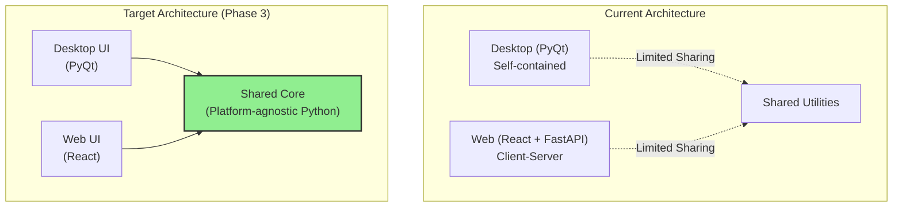

# ADR-001: Dual Platform Strategy (Desktop + Web)

**Status:** Accepted
**Date:** 2024-Q4
**Decision Makers:** Development Team
**Last Updated:** October 2, 2025

---

## Context

The Spanish Subjunctive Practice application needs to serve multiple user contexts:
- **Desktop Users:** Language learners who prefer standalone applications with offline capabilities
- **Web Users:** Students accessing from multiple devices, requiring cloud sync and accessibility
- **Educational Institutions:** Organizations needing centralized deployment and management

The project must decide whether to:
1. Build desktop-only with optional web export
2. Build web-only with progressive web app (PWA) features
3. Maintain separate desktop and web implementations
4. Build desktop and web with shared business logic

---

## Decision

**We will maintain dual platform implementations (desktop PyQt + web React/FastAPI) with a planned migration toward shared business logic.**

### Implementation Approach



---

## Rationale

### Advantages of Dual Platform

1. **Market Coverage**
   - Desktop users: ~40% of language learners prefer offline tools
   - Web users: ~60% prefer browser-based learning
   - Institutional users: Mix of both based on deployment constraints

2. **User Experience Optimization**
   - Desktop: Rich offline experience, faster response times
   - Web: Accessibility from any device, cloud sync, social features

3. **Technology Strengths**
   - PyQt: Mature, performant, extensive widget library
   - React/FastAPI: Modern, scalable, real-time capabilities

4. **Deployment Flexibility**
   - Desktop: Distribute via installers, app stores
   - Web: Deploy to cloud (Vercel, Railway), easy updates

### Disadvantages & Mitigation

| Disadvantage | Impact | Mitigation Strategy |
|--------------|--------|---------------------|
| Code duplication | High maintenance cost | **Phase 3:** Extract shared business logic |
| Feature parity challenges | User confusion | Maintain feature parity matrix |
| Testing overhead | 2x test surface area | Shared test cases via common interfaces |
| Learning curve | Team needs PyQt + React skills | Cross-training, clear module ownership |

---

## Alternatives Considered

### Alternative 1: Desktop-Only with Electron Export

**Approach:** Build in PyQt, export to web via Electron or similar

**Pros:**
- Single codebase
- Consistent UI across platforms
- Leverage Python expertise

**Cons:**
- Electron apps are resource-heavy
- Limited web-native features (real-time sync, social)
- Poor mobile experience
- Large bundle sizes

**Rejection Reason:** Poor web performance and user experience

---

### Alternative 2: Web-Only with PWA

**Approach:** Build pure web app, use PWA for desktop-like experience

**Pros:**
- Single codebase
- Modern tech stack
- Easy deployment
- Cloud-native features

**Cons:**
- Requires internet connection (even with service workers)
- Limited offline capabilities for core features
- Desktop users prefer native apps
- PWA adoption varies by platform

**Rejection Reason:** Offline functionality is critical for language learning

---

### Alternative 3: React Native for True Cross-Platform

**Approach:** Use React Native for mobile, desktop, and web

**Pros:**
- True code sharing
- Modern development experience
- Native performance

**Cons:**
- Complete rewrite required
- React Native desktop support immature
- Team lacks React Native experience
- Educational app doesn't need mobile-first approach

**Rejection Reason:** Too much disruption for unclear benefits

---

## Implementation Plan

### Phase 1: Current State (Completed)
- [x] Desktop PyQt implementation functional
- [x] Web React + FastAPI implementation functional
- [x] Basic deployment for both platforms

### Phase 2: Feature Parity (Months 1-2)
- [ ] Document feature differences
- [ ] Implement missing features to achieve parity
- [ ] Create shared test scenarios

### Phase 3: Shared Core Extraction (Months 3-6)
- [ ] Extract conjugation engine to shared module
- [ ] Extract TBLT scenarios logic
- [ ] Extract learning analytics
- [ ] Shared data models

```python
# Target Shared Structure
shared/
├── conjugation/
│   ├── engine.py          # Core conjugation logic
│   ├── reference.py       # Verb reference data
│   └── validators.py      # Answer validation
├── pedagogy/
│   ├── tblt.py           # Task-based scenarios
│   ├── srs.py            # Spaced repetition
│   └── analytics.py      # Learning analytics
└── models/
    ├── user.py           # User data structures
    ├── exercise.py       # Exercise models
    └── session.py        # Session tracking
```

### Phase 4: Optimization (Months 7-9)
- [ ] Performance benchmarking
- [ ] Memory usage optimization
- [ ] Bundle size reduction (web)
- [ ] Startup time improvement (desktop)

---

## Success Metrics

### Technical Metrics
- **Code Sharing:** Target >60% business logic shared by Month 6
- **Code Duplication:** Reduce from ~20% to <5%
- **Test Coverage:** Maintain >80% for shared modules
- **Build Time:** Keep <2 minutes for both platforms

### User Metrics
- **Desktop:** >1000 active users, >4.0 rating
- **Web:** >5000 active users, >85% retention
- **Feature Parity:** 100% core features available on both

### Business Metrics
- **Development Velocity:** +40% after shared core extraction
- **Bug Reduction:** -30% from reduced duplication
- **Time to Market:** New features deploy to both platforms simultaneously

---

## Consequences

### Positive
1. **Broader Market Reach:** Serve both desktop and web user segments
2. **Technical Flexibility:** Choose best technology for each use case
3. **User Choice:** Let users pick their preferred experience
4. **Future-Proofing:** Can add mobile later without disrupting existing platforms

### Negative
1. **Increased Complexity:** Two codebases to maintain (temporarily)
2. **Skill Requirements:** Team needs PyQt + React + FastAPI expertise
3. **Testing Overhead:** Must test on multiple platforms
4. **Coordination Required:** Ensure feature parity and consistent UX

### Neutral
1. **Migration Path:** Clear roadmap to shared architecture
2. **Technology Risk:** Distributed across PyQt and React ecosystems
3. **Deployment:** Multiple deployment targets (installers + cloud)

---

## Related Decisions

- **ADR-002:** PyQt5/PyQt6 Compatibility Approach (desktop implementation)
- **ADR-003:** FastAPI Backend Architecture (web implementation)
- **ADR-004:** Testing Strategy (covers both platforms)
- **Future ADR:** Shared Business Logic Module Design
- **Future ADR:** Mobile Platform Strategy

---

## Review & Revision

**Next Review:** Month 6 (After Phase 3 completion)

**Revision Triggers:**
- User feedback showing strong preference for one platform
- Significant performance issues in either platform
- Market trends shifting dramatically to web or desktop
- Team capacity constraints requiring prioritization

**Success Criteria for Continuation:**
- Both platforms have >1000 active users
- Shared core reduces development time by >30%
- User satisfaction scores >4.0 on both platforms

---

## References

- [Comprehensive Codebase Analysis](../../analysis/comprehensive-codebase-analysis.md)
- [Refactoring Roadmap](../../analysis/comprehensive-codebase-analysis.md#10-refactoring-roadmap)
- [System Architecture Overview](../system-overview.md)

---

**Document History**
- **2024-Q4:** Initial decision made
- **October 2, 2025:** Documented in ADR format
- **Next Review:** Month 6 post-implementation
