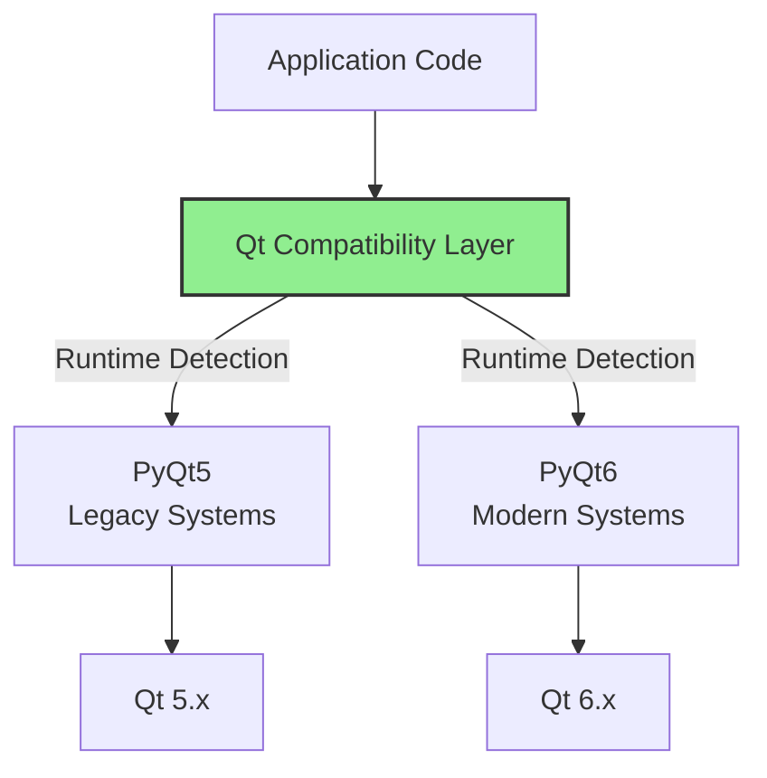

# ADR-002: PyQt5/PyQt6 Compatibility Approach

**Status:** Accepted
**Date:** 2024-Q4
**Decision Makers:** Desktop Team
**Last Updated:** October 2, 2025

---

## Context

The desktop application uses PyQt for its UI framework. PyQt6 was released with breaking changes from PyQt5, creating a compatibility dilemma:

- **PyQt5:** Mature, stable, extensive community resources, widespread adoption
- **PyQt6:** Modern, Qt 6 features, future-focused, but breaking API changes

The project must decide:
1. Commit to PyQt5 only
2. Migrate fully to PyQt6
3. Maintain compatibility with both versions

### Key Differences Between PyQt5 and PyQt6

```python
# PyQt5 Imports
from PyQt5.QtWidgets import QApplication, QWidget
from PyQt5.QtCore import Qt, pyqtSignal
from PyQt5.QtGui import QFont, QIcon

# PyQt6 Imports
from PyQt6.QtWidgets import QApplication, QWidget
from PyQt6.QtCore import Qt, pyqtSignal
from PyQt6.QtGui import QFont, QIcon

# Breaking Changes
# PyQt5
combo.activated[str].connect(handler)
button.clicked[bool].connect(handler)

# PyQt6
combo.activated.connect(handler)  # No type specifiers
button.clicked.connect(handler)
```

---

## Decision

**We will maintain dual compatibility with PyQt5 and PyQt6 through abstraction layers and conditional imports, prioritizing PyQt6 for new development while supporting PyQt5 for legacy systems.**

### Implementation Strategy

```python
# src/ui_system/qt_compat.py
"""
Qt compatibility layer for PyQt5/PyQt6 support.
"""

import sys

try:
    # Try PyQt6 first (preferred)
    from PyQt6.QtWidgets import *
    from PyQt6.QtCore import *
    from PyQt6.QtGui import *
    QT_VERSION = 6
    print("Using PyQt6")
except ImportError:
    try:
        # Fall back to PyQt5
        from PyQt5.QtWidgets import *
        from PyQt5.QtCore import *
        from PyQt5.QtGui import *
        QT_VERSION = 5
        print("Using PyQt5")
    except ImportError:
        raise ImportError("Neither PyQt5 nor PyQt6 is installed")

# Compatibility helpers
def connect_combo_activated(combo, handler):
    """Connect combobox activated signal (handles PyQt5/6 differences)."""
    if QT_VERSION == 6:
        combo.activated.connect(handler)
    else:
        combo.activated[str].connect(handler)

def connect_button_clicked(button, handler):
    """Connect button clicked signal (handles PyQt5/6 differences)."""
    if QT_VERSION == 6:
        button.clicked.connect(handler)
    else:
        button.clicked[bool].connect(handler)
```

---

## Rationale

### Advantages of Dual Compatibility

1. **User Flexibility**
   - Users can install either PyQt5 or PyQt6
   - Supports older systems (PyQt5) and newer Qt 6 features (PyQt6)
   - Reduces installation friction

2. **Migration Path**
   - Gradual migration to PyQt6
   - Test PyQt6 features without breaking PyQt5 support
   - Learn PyQt6 API incrementally

3. **Development Environment Support**
   - Different developers can use different Qt versions
   - CI/CD can test both versions
   - Package maintainers can choose version

4. **Market Coverage**
   - **PyQt5:** Still widely used in enterprises, LTS support
   - **PyQt6:** Growing adoption, modern features

### Compatibility Layer Benefits



---

## Implementation Details

### Directory Structure

```
src/
├── ui_system/
│   ├── qt_compat.py          # Compatibility layer
│   ├── widgets/
│   │   ├── base_widget.py    # Base classes using compat layer
│   │   ├── exercise_widget.py
│   │   └── results_widget.py
│   └── utils/
│       ├── signal_helpers.py  # Signal connection helpers
│       └── widget_factory.py  # Factory for Qt widgets
```

### Compatibility Layer Components

#### 1. Import Abstraction

```python
# src/ui_system/qt_compat.py
"""Centralized Qt import management."""

import sys
from typing import Optional

# Determine Qt version
QT_VERSION: Optional[int] = None

try:
    from PyQt6 import QtWidgets, QtCore, QtGui
    QT_VERSION = 6
    Qt = QtCore.Qt
except ImportError:
    try:
        from PyQt5 import QtWidgets, QtCore, QtGui
        QT_VERSION = 5
        Qt = QtCore.Qt
    except ImportError:
        raise ImportError(
            "Neither PyQt5 nor PyQt6 is installed. "
            "Install one of them: pip install PyQt6 or pip install PyQt5"
        )

# Export commonly used classes
QApplication = QtWidgets.QApplication
QWidget = QtWidgets.QWidget
QMainWindow = QtWidgets.QMainWindow
QLabel = QtWidgets.QLabel
QPushButton = QtWidgets.QPushButton
QLineEdit = QtWidgets.QLineEdit
QComboBox = QtWidgets.QComboBox
# ... (export all commonly used classes)
```

#### 2. Signal Connection Helpers

```python
# src/ui_system/utils/signal_helpers.py
"""Helpers for connecting signals across PyQt versions."""

from ..qt_compat import QT_VERSION

def safe_connect(signal, handler, connection_type=None):
    """
    Connect signal to handler, handling PyQt5/6 differences.

    Args:
        signal: Qt signal to connect
        handler: Callback function
        connection_type: Optional connection type specifier (PyQt5 only)
    """
    if QT_VERSION == 6:
        # PyQt6 doesn't use type specifiers
        signal.connect(handler)
    else:
        # PyQt5 may use type specifiers
        if connection_type:
            signal[connection_type].connect(handler)
        else:
            signal.connect(handler)

# Specific helpers for common patterns
class SignalHelper:
    @staticmethod
    def connect_combo_activated(combo, handler):
        """Connect QComboBox activated signal."""
        safe_connect(combo.activated, handler, str if QT_VERSION == 5 else None)

    @staticmethod
    def connect_button_clicked(button, handler):
        """Connect QPushButton clicked signal."""
        safe_connect(button.clicked, handler, bool if QT_VERSION == 5 else None)

    @staticmethod
    def connect_text_changed(widget, handler):
        """Connect text changed signal."""
        safe_connect(widget.textChanged, handler, str if QT_VERSION == 5 else None)
```

#### 3. Enum Handling

```python
# src/ui_system/utils/enum_compat.py
"""Handle Qt enum differences between PyQt5 and PyQt6."""

from ..qt_compat import QT_VERSION, Qt

def get_alignment(horizontal='left', vertical='center'):
    """
    Get Qt alignment flags (handles PyQt5/6 enum differences).

    PyQt5: Qt.AlignLeft | Qt.AlignVCenter
    PyQt6: Qt.AlignmentFlag.AlignLeft | Qt.AlignmentFlag.AlignVCenter
    """
    h_align = {
        'left': Qt.AlignmentFlag.AlignLeft if QT_VERSION == 6 else Qt.AlignLeft,
        'center': Qt.AlignmentFlag.AlignCenter if QT_VERSION == 6 else Qt.AlignCenter,
        'right': Qt.AlignmentFlag.AlignRight if QT_VERSION == 6 else Qt.AlignRight,
    }

    v_align = {
        'top': Qt.AlignmentFlag.AlignTop if QT_VERSION == 6 else Qt.AlignTop,
        'center': Qt.AlignmentFlag.AlignVCenter if QT_VERSION == 6 else Qt.AlignVCenter,
        'bottom': Qt.AlignmentFlag.AlignBottom if QT_VERSION == 6 else Qt.AlignBottom,
    }

    return h_align.get(horizontal, h_align['left']) | v_align.get(vertical, v_align['center'])
```

---

## Testing Strategy

### Multi-Version CI/CD

```yaml
# .github/workflows/desktop-tests.yml
name: Desktop Tests (PyQt5 & PyQt6)

on: [push, pull_request]

jobs:
  test-pyqt5:
    runs-on: ubuntu-latest
    steps:
      - uses: actions/checkout@v3
      - name: Set up Python
        uses: actions/setup-python@v4
        with:
          python-version: '3.11'
      - name: Install PyQt5
        run: pip install PyQt5
      - name: Run tests
        run: pytest tests/desktop/ -v

  test-pyqt6:
    runs-on: ubuntu-latest
    steps:
      - uses: actions/checkout@v3
      - name: Set up Python
        uses: actions/setup-python@v4
        with:
          python-version: '3.11'
      - name: Install PyQt6
        run: pip install PyQt6
      - name: Run tests
        run: pytest tests/desktop/ -v
```

### Test Cases for Compatibility

```python
# tests/desktop/test_qt_compatibility.py
"""Test PyQt5/PyQt6 compatibility layer."""

import pytest
from src.ui_system.qt_compat import QT_VERSION, QApplication
from src.ui_system.utils.signal_helpers import SignalHelper

def test_qt_version_detection():
    """Test that Qt version is correctly detected."""
    assert QT_VERSION in [5, 6], "Qt version must be 5 or 6"

def test_signal_connection():
    """Test signal connections work in both PyQt5 and PyQt6."""
    app = QApplication([])
    from src.ui_system.qt_compat import QPushButton

    button = QPushButton("Test")
    callback_triggered = []

    def callback():
        callback_triggered.append(True)

    SignalHelper.connect_button_clicked(button, callback)
    button.click()

    assert len(callback_triggered) == 1, "Callback should be triggered once"
```

---

## Consequences

### Positive

1. **Backward Compatibility:** Users on older systems can still use PyQt5
2. **Forward Compatibility:** Gradual migration path to PyQt6
3. **Flexibility:** Developers can use either version in their environment
4. **Reduced Risk:** No forced migration, lower chance of breakage

### Negative

1. **Complexity:** Compatibility layer adds indirection
2. **Maintenance:** Must test both versions
3. **Performance:** Small overhead from runtime version detection
4. **Documentation:** Must document both usage patterns

### Mitigation Strategies

```python
# Performance: Cache version checks
_QT_VERSION = QT_VERSION  # Cache at module level

# Documentation: Clear examples
"""
Example usage:
    # Both PyQt5 and PyQt6 compatible
    from src.ui_system.qt_compat import QPushButton
    from src.ui_system.utils.signal_helpers import SignalHelper

    button = QPushButton("Click me")
    SignalHelper.connect_button_clicked(button, on_click)
"""
```

---

## Migration Path

### Phase 1: Compatibility Layer (Completed)
- [x] Create `qt_compat.py`
- [x] Implement signal helpers
- [x] Add enum compatibility

### Phase 2: Refactor Existing Code (Months 1-2)
- [ ] Update all imports to use compatibility layer
- [ ] Replace direct signal connections with helpers
- [ ] Test both PyQt5 and PyQt6

### Phase 3: PyQt6 Optimization (Months 3-6)
- [ ] Add PyQt6-specific features (optional)
- [ ] Performance profiling
- [ ] Deprecation warnings for PyQt5-only code

### Phase 4: Potential PyQt6-Only (Year 2+)
- [ ] Evaluate PyQt5 usage metrics
- [ ] If PyQt5 usage <5%, consider dropping support
- [ ] Simplify compatibility layer

---

## Alternatives Considered

### Alternative 1: PyQt5 Only

**Pros:**
- Simpler codebase
- No compatibility layer needed
- More stable, mature

**Cons:**
- No access to Qt 6 features
- Eventually unsupported
- Locks out PyQt6 users

**Rejection Reason:** Limits future growth and modern Qt features

---

### Alternative 2: PyQt6 Only

**Pros:**
- Modern features
- Simpler code
- Future-focused

**Cons:**
- Forces users to upgrade
- Breaks existing PyQt5 installations
- Higher system requirements

**Rejection Reason:** Too disruptive for existing users

---

### Alternative 3: PySide6

**Pros:**
- LGPL license (more permissive)
- Official Qt binding
- Similar to PyQt6

**Cons:**
- Complete rewrite required
- Different API in places
- Less community resources

**Rejection Reason:** Too much disruption for marginal benefits

---

## Success Metrics

- **Compatibility:** 100% of features work in both PyQt5 and PyQt6
- **Test Coverage:** >90% for compatibility layer
- **Performance:** <1% overhead from compatibility checks
- **User Adoption:** Support both versions for at least 2 years

---

## Related Decisions

- **ADR-001:** Dual Platform Strategy (desktop is one platform)
- **ADR-004:** Testing Strategy (includes PyQt version testing)
- **Future ADR:** Desktop UI Framework Evolution

---

## References

- [PyQt5 Documentation](https://www.riverbankcomputing.com/static/Docs/PyQt5/)
- [PyQt6 Documentation](https://www.riverbankcomputing.com/static/Docs/PyQt6/)
- [Qt 5 to Qt 6 Migration Guide](https://doc.qt.io/qt-6/portingguide.html)

---

**Document History**
- **2024-Q4:** Initial implementation
- **October 2, 2025:** Documented in ADR format
- **Next Review:** After 1 year of dual compatibility support
