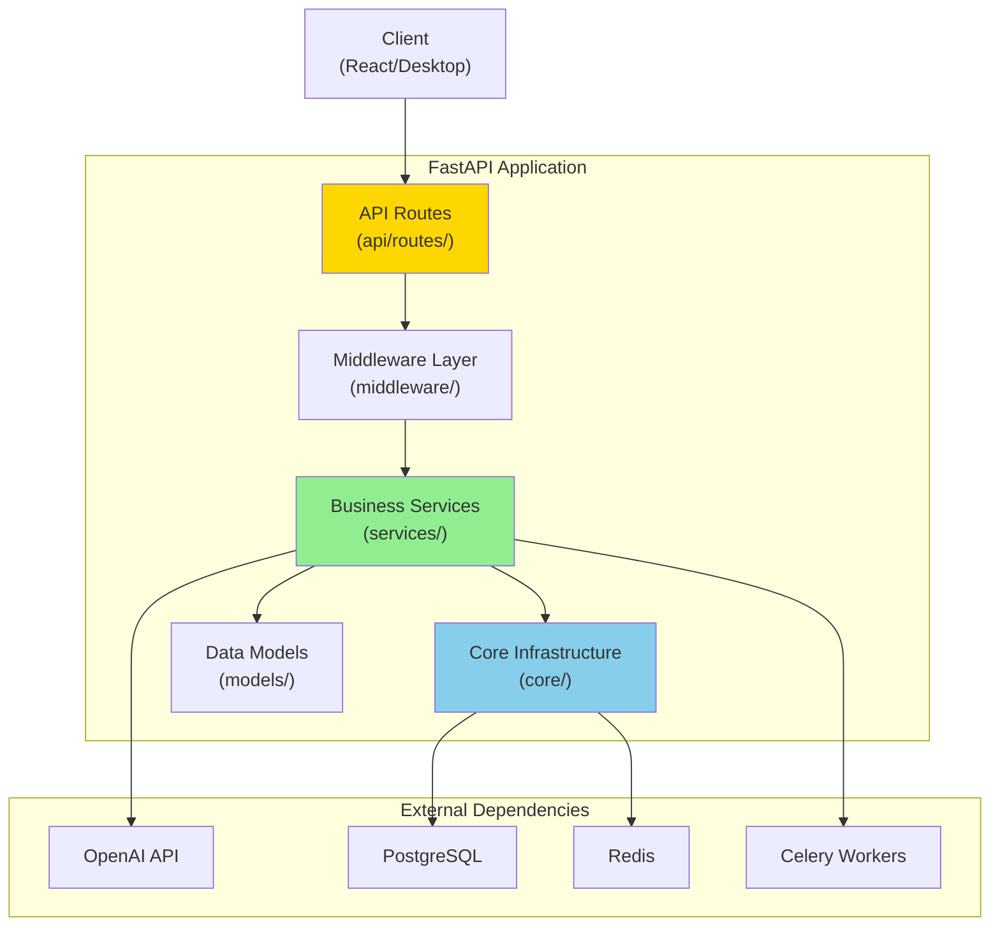

# ADR-003: FastAPI Backend Architecture

**Status:** Accepted
**Date:** 2024-Q4
**Decision Makers:** Backend Team
**Last Updated:** October 2, 2025

---

## Context

The web application requires a robust backend API to support:
- User authentication and authorization
- Exercise generation and validation
- Progress tracking and analytics
- Real-time features (WebSockets)
- AI integration (OpenAI GPT-4)
- Scalability for multiple concurrent users

### Backend Framework Options

The team evaluated several Python web frameworks:

| Framework | Strengths | Weaknesses |
|-----------|-----------|------------|
| **FastAPI** | Modern, async, automatic docs, type safety | Relatively new (2018) |
| **Django** | Mature, batteries-included, ORM | Synchronous, heavyweight for API-only |
| **Flask** | Lightweight, flexible, mature | No built-in async, less structure |
| **Tornado** | Async, real-time focused | Lower-level, less community support |
| **aiohttp** | Pure async, performant | More boilerplate, less opinionated |

---

## Decision

**We will use FastAPI as the backend framework, leveraging its async capabilities, automatic OpenAPI documentation, and Pydantic validation.**

### Architecture Overview



---

## Rationale

### Why FastAPI?

#### 1. Performance

**Async/Await Support:** Built on Starlette and uvloop
```python
# Native async support
@app.get("/exercises/{exercise_id}")
async def get_exercise(exercise_id: int, db: AsyncSession = Depends(get_db)):
    exercise = await db.get(Exercise, exercise_id)
    return exercise
```

**Benchmarks:**
- FastAPI: ~20,000-25,000 req/sec
- Flask: ~5,000-10,000 req/sec
- Django: ~3,000-8,000 req/sec

**Result:** 2-3x better performance than alternatives

#### 2. Developer Experience

**Automatic API Documentation:**
```python
@app.post("/auth/register", response_model=UserResponse)
async def register_user(user: UserCreate):
    """
    Register a new user account.

    - **email**: Valid email address
    - **password**: Minimum 8 characters
    - **name**: User's display name
    """
    # Implementation
    pass
```

Generates:
- Interactive Swagger UI at `/docs`
- ReDoc documentation at `/redoc`
- OpenAPI schema at `/openapi.json`

**Type Safety with Pydantic:**
```python
from pydantic import BaseModel, EmailStr, validator

class UserCreate(BaseModel):
    email: EmailStr
    password: str
    name: str

    @validator('password')
    def password_strength(cls, v):
        if len(v) < 8:
            raise ValueError('Password must be at least 8 characters')
        return v
```

**Result:** Automatic validation, serialization, and documentation

#### 3. Modern Python Features

**Dependency Injection:**
```python
async def get_current_user(token: str = Depends(oauth2_scheme)) -> User:
    """Dependency for getting authenticated user."""
    # Validate JWT, fetch user
    return user

@app.get("/profile")
async def get_profile(current_user: User = Depends(get_current_user)):
    return current_user
```

**Type Hints Everywhere:**
```python
from typing import List, Optional

@app.get("/exercises", response_model=List[ExerciseResponse])
async def list_exercises(
    skip: int = 0,
    limit: int = 100,
    difficulty: Optional[str] = None
) -> List[Exercise]:
    # Fully type-checked
    pass
```

#### 4. Ecosystem Integration

**SQLAlchemy 2.0 (Async):**
```python
from sqlalchemy.ext.asyncio import AsyncSession, create_async_engine

async def get_db() -> AsyncSession:
    async with async_session_maker() as session:
        yield session

@app.get("/users/{user_id}")
async def get_user(user_id: int, db: AsyncSession = Depends(get_db)):
    result = await db.execute(select(User).where(User.id == user_id))
    return result.scalar_one()
```

**Redis Integration:**
```python
from redis.asyncio import Redis

async def get_redis() -> Redis:
    return Redis(host='localhost', port=6379, decode_responses=True)

@app.get("/cached-data")
async def get_cached(redis: Redis = Depends(get_redis)):
    return await redis.get("key")
```

**WebSocket Support:**
```python
@app.websocket("/ws/progress/{user_id}")
async def progress_websocket(websocket: WebSocket, user_id: int):
    await websocket.accept()
    while True:
        progress = await get_user_progress(user_id)
        await websocket.send_json(progress)
        await asyncio.sleep(1)
```

---

## Implementation Details

### Project Structure

```
backend/
├── main.py                    # Application entry point
├── api/
│   └── routes/
│       ├── auth.py           # Authentication endpoints
│       ├── exercises.py      # Exercise CRUD
│       ├── review.py         # Review session endpoints
│       └── analytics.py      # Analytics endpoints
├── core/
│   ├── config.py             # Configuration management
│   ├── database.py           # Database connection
│   ├── security.py           # Security utilities (JWT, hashing)
│   └── redis_client.py       # Redis connection
├── services/
│   ├── openai_service.py     # OpenAI integration
│   ├── tblt_service.py       # TBLT scenario generation
│   ├── spaced_repetition.py  # SRS algorithm
│   └── gamification.py       # Gamification logic
├── models/
│   ├── user.py               # User data models
│   ├── exercise.py           # Exercise models
│   ├── progress.py           # Progress tracking
│   └── srs_models.py         # SRS-specific models
├── schemas/
│   ├── user.py               # User Pydantic schemas
│   ├── exercise.py           # Exercise schemas
│   └── response.py           # Response schemas
├── middleware/
│   ├── security.py           # Security headers
│   ├── rate_limiter.py       # Rate limiting
│   └── error_handling.py     # Global error handler
├── database/
│   ├── models.py             # SQLAlchemy models
│   └── utils.py              # Database utilities
└── alembic/
    ├── versions/             # Database migrations
    └── env.py                # Alembic configuration
```

### Core Components

#### 1. Application Initialization

```python
# backend/main.py
from fastapi import FastAPI
from fastapi.middleware.cors import CORSMiddleware
from api.routes import auth, exercises, review, analytics
from core.config import settings
from middleware.security import SecurityHeadersMiddleware
from middleware.rate_limiter import RateLimitMiddleware

app = FastAPI(
    title="Spanish Subjunctive Practice API",
    version="1.0.0",
    description="API for Spanish subjunctive learning platform",
    docs_url="/docs",
    redoc_url="/redoc",
)

# CORS configuration
app.add_middleware(
    CORSMiddleware,
    allow_origins=settings.ALLOWED_ORIGINS,
    allow_credentials=True,
    allow_methods=["*"],
    allow_headers=["*"],
)

# Custom middleware
app.add_middleware(SecurityHeadersMiddleware)
app.add_middleware(RateLimitMiddleware)

# Include routers
app.include_router(auth.router, prefix="/api/auth", tags=["Authentication"])
app.include_router(exercises.router, prefix="/api/exercises", tags=["Exercises"])
app.include_router(review.router, prefix="/api/review", tags=["Review"])
app.include_router(analytics.router, prefix="/api/analytics", tags=["Analytics"])

@app.get("/health")
async def health_check():
    return {"status": "healthy"}
```

#### 2. Dependency Injection Pattern

```python
# backend/core/database.py
from sqlalchemy.ext.asyncio import AsyncSession, create_async_engine, async_sessionmaker
from core.config import settings

engine = create_async_engine(settings.DATABASE_URL, echo=settings.DEBUG)
async_session_maker = async_sessionmaker(engine, expire_on_commit=False)

async def get_db() -> AsyncSession:
    """Database session dependency."""
    async with async_session_maker() as session:
        try:
            yield session
            await session.commit()
        except Exception:
            await session.rollback()
            raise
        finally:
            await session.close()

# Usage in routes
@app.get("/users")
async def get_users(db: AsyncSession = Depends(get_db)):
    result = await db.execute(select(User))
    return result.scalars().all()
```

#### 3. Service Layer

```python
# backend/services/tblt_service.py
from typing import List
from models.scenario import Scenario
from services.openai_service import OpenAIService
from core.redis_client import get_redis

class TBLTService:
    """Task-Based Language Teaching scenario service."""

    def __init__(self, db: AsyncSession, openai: OpenAIService):
        self.db = db
        self.openai = openai

    async def generate_scenario(
        self,
        user_level: str,
        verb_tense: str,
        context: str
    ) -> Scenario:
        """Generate a new TBLT scenario."""
        # Check cache
        cache_key = f"scenario:{user_level}:{verb_tense}:{context}"
        redis = await get_redis()
        cached = await redis.get(cache_key)

        if cached:
            return Scenario.parse_raw(cached)

        # Generate with OpenAI
        prompt = self._build_prompt(user_level, verb_tense, context)
        response = await self.openai.generate_completion(prompt)

        # Parse and save
        scenario = self._parse_scenario(response)
        await self.db.add(scenario)
        await self.db.commit()

        # Cache for 1 hour
        await redis.setex(cache_key, 3600, scenario.json())

        return scenario
```

#### 4. Authentication & Authorization

```python
# backend/core/security.py
from datetime import datetime, timedelta
from jose import JWTError, jwt
from passlib.context import CryptContext
from core.config import settings

pwd_context = CryptContext(schemes=["bcrypt"], deprecated="auto")

def verify_password(plain_password: str, hashed_password: str) -> bool:
    """Verify a password against its hash."""
    return pwd_context.verify(plain_password, hashed_password)

def get_password_hash(password: str) -> str:
    """Hash a password."""
    return pwd_context.hash(password)

def create_access_token(data: dict, expires_delta: timedelta = None) -> str:
    """Create a JWT access token."""
    to_encode = data.copy()
    expire = datetime.utcnow() + (expires_delta or timedelta(minutes=15))
    to_encode.update({"exp": expire})
    return jwt.encode(to_encode, settings.SECRET_KEY, algorithm="HS256")

async def get_current_user(token: str = Depends(oauth2_scheme)) -> User:
    """Get current authenticated user from JWT."""
    try:
        payload = jwt.decode(token, settings.SECRET_KEY, algorithms=["HS256"])
        user_id: int = payload.get("sub")
        if user_id is None:
            raise HTTPException(status_code=401, detail="Invalid token")
    except JWTError:
        raise HTTPException(status_code=401, detail="Invalid token")

    # Fetch user from database
    user = await db.get(User, user_id)
    if user is None:
        raise HTTPException(status_code=401, detail="User not found")

    return user
```

---

## Performance Optimization Strategies

### 1. Async Everywhere

```python
# All I/O operations are async
async def process_exercise(exercise_id: int):
    # Database query (async)
    exercise = await db.get(Exercise, exercise_id)

    # OpenAI API call (async)
    feedback = await openai.generate_feedback(exercise)

    # Redis cache update (async)
    await redis.set(f"exercise:{exercise_id}", exercise.json())

    return feedback
```

### 2. Connection Pooling

```python
# backend/core/database.py
engine = create_async_engine(
    settings.DATABASE_URL,
    pool_size=20,          # Max connections
    max_overflow=10,       # Extra connections in high load
    pool_pre_ping=True,    # Verify connection before use
    pool_recycle=3600,     # Recycle connections every hour
)
```

### 3. Caching Strategy

```python
# Three-tier caching
# 1. Application-level (in-memory)
from functools import lru_cache

@lru_cache(maxsize=1000)
def get_verb_conjugation(verb: str, tense: str) -> dict:
    # Expensive computation cached in memory
    pass

# 2. Redis (distributed)
async def get_user_progress(user_id: int):
    cache_key = f"progress:{user_id}"
    cached = await redis.get(cache_key)
    if cached:
        return json.loads(cached)

    # Fetch from database
    progress = await db.query(Progress).filter_by(user_id=user_id).all()
    await redis.setex(cache_key, 300, json.dumps(progress))
    return progress

# 3. Database (persistent)
# Already handled by SQLAlchemy
```

### 4. Background Tasks

```python
from fastapi import BackgroundTasks

@app.post("/exercises/submit")
async def submit_exercise(
    exercise: ExerciseSubmission,
    background_tasks: BackgroundTasks,
    current_user: User = Depends(get_current_user)
):
    # Quick validation and response
    result = await validate_answer(exercise)

    # Defer expensive operations
    background_tasks.add_task(update_analytics, current_user.id, result)
    background_tasks.add_task(train_srs_model, current_user.id, exercise)
    background_tasks.add_task(send_notification, current_user.id)

    return {"result": result}
```

---

## Testing Strategy

### 1. Unit Tests

```python
# tests/backend/unit/test_conjugation_api.py
import pytest
from httpx import AsyncClient
from main import app

@pytest.mark.asyncio
async def test_get_conjugation():
    async with AsyncClient(app=app, base_url="http://test") as client:
        response = await client.get("/api/conjugations/hablar/present_subjunctive")
        assert response.status_code == 200
        data = response.json()
        assert data["verb"] == "hablar"
        assert "hable" in data["forms"]
```

### 2. Integration Tests

```python
# tests/backend/integration/test_exercise_flow.py
@pytest.mark.asyncio
async def test_full_exercise_flow(test_db, test_user):
    # Create exercise
    exercise = await create_exercise(test_db, difficulty="intermediate")

    # Submit answer
    result = await submit_answer(test_user, exercise, "hable")
    assert result.is_correct is True

    # Check progress updated
    progress = await get_user_progress(test_user.id)
    assert progress.exercises_completed == 1
```

---

## Consequences

### Positive

1. **Performance:** 2-3x faster than Django/Flask
2. **Developer Experience:** Automatic docs, type safety, modern Python
3. **Scalability:** Async enables high concurrency
4. **Maintainability:** Clear structure, dependency injection
5. **API-First:** Perfect for web + desktop clients

### Negative

1. **Learning Curve:** Async patterns require understanding
2. **Debugging:** Async stack traces can be complex
3. **Ecosystem Maturity:** Fewer third-party libraries than Django
4. **Database Migrations:** Alembic is separate (not built-in like Django)

### Mitigation

- **Training:** Team async/await workshop
- **Tooling:** Sentry for async error tracking
- **Documentation:** Comprehensive API examples
- **Migration Strategy:** Alembic integrated early in development

---

## Alternatives Considered

### Alternative 1: Django REST Framework

**Pros:**
- Mature ecosystem
- Built-in admin panel
- ORM with migrations
- Large community

**Cons:**
- Synchronous (blocking I/O)
- Heavyweight for API-only
- Slower performance
- Less modern async patterns

**Rejection Reason:** Performance and async requirements

---

### Alternative 2: Flask + Flask-RESTful

**Pros:**
- Lightweight
- Flexible
- Large community
- Familiar to team

**Cons:**
- No native async support
- Manual API documentation
- Less structure (good and bad)
- Requires many extensions

**Rejection Reason:** Lack of async and manual documentation burden

---

## Success Metrics

- **Response Time:** p95 < 200ms for all endpoints
- **Throughput:** Support 10,000+ concurrent users
- **Uptime:** 99.9% availability
- **API Documentation:** 100% endpoint coverage in OpenAPI
- **Test Coverage:** >85% for API routes and services

---

## Related Decisions

- **ADR-001:** Dual Platform Strategy (FastAPI serves web + desktop)
- **ADR-004:** Testing Strategy (includes API testing)
- **Future ADR:** Microservices Migration (if needed at scale)

---

## References

- [FastAPI Documentation](https://fastapi.tiangolo.com/)
- [SQLAlchemy 2.0 Async](https://docs.sqlalchemy.org/en/20/orm/extensions/asyncio.html)
- [Pydantic Documentation](https://docs.pydantic.dev/)
- [Starlette Documentation](https://www.starlette.io/)

---

**Document History**
- **2024-Q4:** FastAPI chosen and implemented
- **October 2, 2025:** Documented in ADR format
- **Next Review:** After reaching 10,000 users or performance issues
