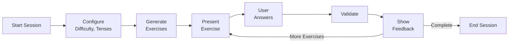

# Component Catalog
## Spanish Subjunctive Practice Application

**Last Updated:** October 2, 2025
**Version:** 1.0
**Purpose:** Comprehensive catalog of all major components, modules, and services

---

## Table of Contents
1. [Backend Components](#backend-components)
2. [Desktop Components](#desktop-components)
3. [Frontend Components](#frontend-components)
4. [Shared Components](#shared-components)
5. [Infrastructure Components](#infrastructure-components)

---

## Backend Components

### API Routes (`/backend/api/routes/`)

#### Authentication Routes (`auth.py`)
**Purpose:** User authentication and authorization
**Endpoints:**
- `POST /api/auth/register` - User registration
- `POST /api/auth/login` - User login
- `POST /api/auth/refresh` - Refresh JWT token
- `POST /api/auth/logout` - User logout
- `GET /api/auth/me` - Get current user info

**Dependencies:**
- `backend/core/security.py` (JWT, password hashing)
- `backend/models/user.py` (User model)
- `backend/core/database.py` (Database session)

**Key Features:**
- JWT token generation and validation
- Password hashing with bcrypt
- Session management
- Email verification

---

#### Review Routes (`review.py`)
**Purpose:** Manage review sessions and spaced repetition
**Endpoints:**
- `GET /api/review/due` - Get due review cards
- `POST /api/review/submit` - Submit review result
- `GET /api/review/stats` - Get review statistics

**Dependencies:**
- `backend/services/spaced_repetition.py` (SRS algorithm)
- `backend/models/srs_models.py` (Card, Review models)

**Key Features:**
- SM-2 spaced repetition algorithm
- Difficulty adjustment
- Progress tracking

---

### Core Services (`/backend/core/`)

#### Database (`database.py`)
**Purpose:** Database connection and session management
**Type:** Infrastructure
**Key Functions:**
- `get_db()` - Async database session factory
- `init_db()` - Initialize database
- `create_tables()` - Create all tables

**Technology:**
- SQLAlchemy 2.0 (async)
- PostgreSQL
- Connection pooling

**Configuration:**
```python
engine = create_async_engine(
    settings.DATABASE_URL,
    pool_size=20,
    max_overflow=10,
    pool_pre_ping=True
)
```

---

#### Security (`security.py`)
**Purpose:** Authentication, authorization, and cryptography
**Type:** Infrastructure
**Key Functions:**
- `verify_password(plain, hashed)` - Password verification
- `get_password_hash(password)` - Hash password
- `create_access_token(data)` - Generate JWT
- `get_current_user(token)` - Extract user from JWT

**Technology:**
- python-jose (JWT)
- passlib + bcrypt (password hashing)

---

#### Redis Client (`redis_client.py`)
**Purpose:** Caching and session storage
**Type:** Infrastructure
**Key Functions:**
- `get_redis()` - Get Redis connection
- `cache_get(key)` - Retrieve cached value
- `cache_set(key, value, ttl)` - Store cached value
- `cache_delete(key)` - Invalidate cache

**Use Cases:**
- Session storage
- API response caching
- Rate limiting counters
- Temporary data storage

---

### Business Services (`/backend/services/`)

#### OpenAI Service (`openai_service.py`)
**Purpose:** AI-powered content generation and feedback
**Type:** Business Logic
**Key Functions:**
- `generate_tblt_scenario()` - Generate contextual scenarios
- `generate_feedback()` - Personalized error feedback
- `generate_explanation()` - Grammar explanations
- `translate_text()` - Translation assistance

**API Integration:**
```python
async def generate_completion(prompt: str) -> str:
    response = await openai.ChatCompletion.acreate(
        model="gpt-4",
        messages=[{"role": "user", "content": prompt}],
        temperature=0.7,
        max_tokens=500
    )
    return response.choices[0].message.content
```

**Features:**
- Async API calls
- Response caching
- Error handling and retries
- Token usage tracking

---

#### TBLT Service (`tblt_service.py`)
**Purpose:** Task-Based Language Teaching scenario management
**Type:** Business Logic
**Key Functions:**
- `generate_scenario(verb, tense, context)` - Create new scenario
- `get_scenario_by_id(id)` - Retrieve scenario
- `list_scenarios(filters)` - Query scenarios
- `validate_scenario_answer(scenario, answer)` - Check correctness

**Features:**
- Context-aware scenario generation
- Difficulty adjustment
- Multiple scenario types (dialogue, narrative, fill-in-blank)
- Integration with OpenAI for authentic contexts

---

#### Spaced Repetition Service (`spaced_repetition.py`)
**Purpose:** Implement SM-2 algorithm for optimal review scheduling
**Type:** Business Logic
**Key Functions:**
- `calculate_next_interval(quality, interval, repetitions)` - SM-2 algorithm
- `get_due_cards(user_id)` - Fetch cards due for review
- `update_card_strength(card_id, quality)` - Update after review
- `get_learning_stats(user_id)` - Calculate retention metrics

**Algorithm:**
```python
# SM-2 Algorithm (Simplified)
if quality >= 3:  # Correct recall
    if repetitions == 0:
        interval = 1 day
    elif repetitions == 1:
        interval = 6 days
    else:
        interval = previous_interval * ease_factor
else:  # Incorrect recall
    interval = 1 day
    repetitions = 0
```

---

#### Gamification Service (`gamification.py`)
**Purpose:** Achievements, streaks, and motivation systems
**Type:** Business Logic
**Key Functions:**
- `award_achievement(user_id, achievement_type)` - Grant achievement
- `update_streak(user_id)` - Track daily practice streak
- `calculate_xp(exercise_result)` - Award experience points
- `get_leaderboard(period)` - Fetch rankings

**Features:**
- Achievement badges
- Daily streak tracking
- XP and leveling system
- Social leaderboards

---

### Data Models (`/backend/models/`)

#### User Model (`user.py`)
**Purpose:** User account and profile data
**Schema:**
```python
class User(Base):
    __tablename__ = "users"

    id: int
    email: str (unique, indexed)
    hashed_password: str
    name: str
    level: str (beginner, intermediate, advanced)
    created_at: datetime
    last_login: datetime
    is_active: bool
    is_verified: bool
```

---

#### Scenario Model (`scenario.py`)
**Purpose:** TBLT scenario data
**Schema:**
```python
class Scenario(Base):
    __tablename__ = "scenarios"

    id: int
    verb: str
    tense: str
    context: str
    text: str (scenario content)
    blank_position: int
    correct_answer: str
    difficulty: str
    created_by: int (foreign key to User)
    created_at: datetime
```

---

#### Progress Model (`progress.py`)
**Purpose:** User learning progress tracking
**Schema:**
```python
class Progress(Base):
    __tablename__ = "progress"

    id: int
    user_id: int (foreign key)
    exercises_completed: int
    correct_answers: int
    accuracy_rate: float
    total_time_seconds: int
    last_session: datetime
    current_streak: int
    longest_streak: int
```

---

#### SRS Models (`srs_models.py`)
**Purpose:** Spaced repetition system data
**Schema:**
```python
class Card(Base):
    __tablename__ = "cards"

    id: int
    user_id: int
    verb: str
    tense: str
    ease_factor: float (default 2.5)
    interval: int (days)
    repetitions: int
    next_review: datetime

class Review(Base):
    __tablename__ = "reviews"

    id: int
    card_id: int
    user_id: int
    quality: int (0-5)
    reviewed_at: datetime
    time_taken_seconds: int
```

---

### Middleware (`/backend/middleware/`)

#### Security Middleware (`security.py`)
**Purpose:** HTTP security headers
**Headers Added:**
- `X-Content-Type-Options: nosniff`
- `X-Frame-Options: DENY`
- `X-XSS-Protection: 1; mode=block`
- `Strict-Transport-Security: max-age=31536000`
- `Content-Security-Policy: default-src 'self'`

---

#### Rate Limiter (`rate_limiter.py`)
**Purpose:** Prevent API abuse
**Strategy:** Token bucket algorithm
**Limits:**
- Anonymous users: 100 requests/hour
- Authenticated users: 1000 requests/hour
- OpenAI endpoints: 50 requests/hour

---

#### Error Handler (`error_handling.py`)
**Purpose:** Global exception handling
**Features:**
- Structured error responses
- Logging integration
- Sentry error tracking
- User-friendly error messages

---

## Desktop Components

### Core Business Logic (`/src/core/`)

#### Conjugation Reference (`conjugation_reference.py`)
**Purpose:** Comprehensive Spanish verb conjugation data
**Type:** Data + Logic
**Key Functions:**
- `get_conjugation(verb, tense, person)` - Get conjugated form
- `validate_conjugation(verb, tense, answer)` - Check correctness
- `get_all_forms(verb, tense)` - All conjugations for tense
- `is_irregular(verb)` - Check if verb is irregular

**Data Structure:**
```python
conjugations = {
    "hablar": {
        "present_subjunctive": {
            "yo": "hable",
            "tú": "hables",
            "él/ella": "hable",
            "nosotros": "hablemos",
            "vosotros": "habléis",
            "ellos": "hablen"
        }
    }
}
```

---

#### Learning Analytics (`learning_analytics.py`)
**Purpose:** Track and analyze user performance
**Type:** Business Logic
**Key Functions:**
- `calculate_accuracy(user_id, time_period)` - Accuracy metrics
- `identify_weak_areas(user_id)` - Problem tenses/verbs
- `predict_mastery(user_id, verb)` - Estimate mastery level
- `generate_recommendations(user_id)` - Personalized study plan

**Metrics Tracked:**
- Overall accuracy
- Per-tense accuracy
- Per-verb accuracy
- Time spent per exercise
- Learning velocity
- Retention rate

---

#### Session Manager (`session_manager.py`)
**Purpose:** Manage practice sessions and exercise flow
**Type:** Business Logic
**Key Functions:**
- `start_session(user_id, settings)` - Initialize session
- `get_next_exercise(session_id)` - Fetch next exercise
- `submit_answer(session_id, answer)` - Process answer
- `end_session(session_id)` - Finalize session

**Session Flow:**


---

#### TBLT Scenarios (`tblt_scenarios.py`)
**Purpose:** Task-based scenario generation (desktop version)
**Type:** Business Logic
**Key Functions:**
- `generate_scenario(verb, tense, context)` - Create scenario
- `get_scenario_templates()` - Retrieve templates
- `customize_scenario(template, params)` - Personalize scenario

---

#### Subjunctive Comprehensive (`subjunctive_comprehensive.py`)
**Purpose:** Comprehensive subjunctive teaching module
**Type:** Business Logic
**Key Functions:**
- `get_subjunctive_rules()` - Grammar rules
- `get_trigger_phrases()` - Common subjunctive triggers
- `generate_examples(rule)` - Example sentences
- `explain_usage(context)` - Context-specific explanations

---

### UI System (`/src/ui_system/`)

#### Accessibility Module (`accessibility/`)

**Components:**
- `accessibility_manager.py` - Global accessibility settings
- `accessibility_theme_integration.py` - Theme integration
- `wcag_validator.py` - WCAG compliance checking

**Features:**
- High contrast themes
- Screen reader support
- Keyboard navigation
- Customizable font sizes
- Color blindness modes

---

#### Typography Module (`typography/`)

**Components:**
- `font_manager.py` - Font loading and management
- `typography_system.py` - Typography scale and styles
- `enhanced_typography_system.py` - Advanced typography features

**Features:**
- Modular scale (1.25 ratio)
- Responsive font sizing
- Font weight variants
- Line height optimization

---

#### Layout Module (`layout/`)

**Components:**
- `responsive_design.py` - Responsive layout utilities
- `optimized_layout.py` - Layout optimization
- `spacing_system.py` - Consistent spacing

**Features:**
- Grid system
- Flexbox utilities
- Responsive breakpoints
- Spacing scale (8px base)

---

#### Colors Module (`colors/`)

**Components:**
- `modern_color_system.py` - Color palette
- `contrast_improvements.py` - WCAG contrast validation
- `theme_manager.py` - Light/dark themes

**Color Palette:**
```python
colors = {
    "primary": "#3B82F6",      # Blue
    "secondary": "#8B5CF6",    # Purple
    "success": "#10B981",      # Green
    "error": "#EF4444",        # Red
    "warning": "#F59E0B",      # Orange
    "info": "#06B6D4",         # Cyan
}
```

---

### UI Components (`/src/`)

#### Main Window (`main.py`, `main_enhanced.py`)
**Purpose:** Application entry point and main window
**Type:** UI Container
**Key Features:**
- Menu bar (File, Edit, View, Help)
- Toolbar (Quick actions)
- Status bar (Session info)
- Central widget (Exercise area)

---

#### Exercise Widget
**Purpose:** Display and interact with exercises
**Type:** UI Component
**Features:**
- Question display
- Answer input
- Submit button
- Feedback display
- Hint system

---

#### Results Widget
**Purpose:** Show session results and statistics
**Type:** UI Component
**Features:**
- Accuracy chart
- Time per exercise
- Weak areas identification
- Recommendations

---

## Frontend Components (Web)

### React Components (`/frontend/components/`)

#### Layout Components
- `Header.tsx` - Application header
- `Sidebar.tsx` - Navigation sidebar
- `Footer.tsx` - Application footer
- `Layout.tsx` - Page layout wrapper

---

#### Exercise Components
- `ExerciseCard.tsx` - Individual exercise display
- `AnswerInput.tsx` - User input for answers
- `FeedbackPanel.tsx` - Show feedback and explanations
- `HintButton.tsx` - Progressive hint system

---

#### Progress Components
- `ProgressBar.tsx` - Visual progress indicator
- `StatsCard.tsx` - Statistical summary
- `AchievementBadge.tsx` - Achievement display
- `StreakCounter.tsx` - Daily streak tracker

---

### Custom Hooks (`/frontend/hooks/`)

#### `useExercise.ts`
**Purpose:** Exercise state management
**API:**
```typescript
const {
  currentExercise,
  loading,
  error,
  submitAnswer,
  nextExercise,
  skipExercise
} = useExercise(sessionId);
```

---

#### `useAuth.ts`
**Purpose:** Authentication state
**API:**
```typescript
const {
  user,
  isAuthenticated,
  login,
  logout,
  register
} = useAuth();
```

---

## Shared Components (Target Architecture)

**Note:** These are planned for Phase 3 refactoring

### Conjugation Module (`/shared/conjugation/`)
- `engine.py` - Core conjugation logic
- `reference.py` - Verb data
- `validators.py` - Answer validation

---

### Pedagogy Module (`/shared/pedagogy/`)
- `tblt.py` - Task-based scenarios
- `srs.py` - Spaced repetition
- `analytics.py` - Learning analytics

---

### Models Module (`/shared/models/`)
- `user.py` - User data structures
- `exercise.py` - Exercise models
- `session.py` - Session tracking

---

## Infrastructure Components

### Database
**Technology:** PostgreSQL 14
**Purpose:** Primary data store
**Schema:** 15+ tables (users, scenarios, progress, cards, reviews, achievements)

---

### Cache
**Technology:** Redis 7
**Purpose:** Session storage, API caching
**Use Cases:**
- User sessions
- API response caching
- Rate limiting
- Real-time data

---

### Task Queue
**Technology:** Celery + Redis
**Purpose:** Background job processing
**Jobs:**
- Email sending
- Analytics calculation
- Report generation
- Data export

---

### Monitoring
**Technology:** Prometheus + Grafana
**Metrics:**
- Request rate
- Response time
- Error rate
- Database query time
- Cache hit rate

---

### Logging
**Technology:** Python logging + Sentry
**Levels:**
- DEBUG: Development details
- INFO: General information
- WARNING: Potential issues
- ERROR: Errors with recovery
- CRITICAL: System failures

---

## Component Dependencies Matrix

| Component | Dependencies | Dependents |
|-----------|--------------|------------|
| `conjugation_reference.py` | None | `session_manager.py`, `tblt_scenarios.py`, Backend API |
| `learning_analytics.py` | `progress.py`, `srs_models.py` | `session_manager.py`, Analytics routes |
| `openai_service.py` | OpenAI API, `redis_client.py` | `tblt_service.py`, Feedback routes |
| `spaced_repetition.py` | `srs_models.py`, `database.py` | Review routes, `session_manager.py` |
| `session_manager.py` | `conjugation_reference.py`, `learning_analytics.py`, `tblt_scenarios.py` | Desktop UI, Web UI |

---

## Related Documentation

- [System Architecture Overview](./system-overview.md)
- [ADR-001: Dual Platform Strategy](./architecture-decision-records/ADR-001-dual-platform-strategy.md)
- [ADR-003: FastAPI Backend Architecture](./architecture-decision-records/ADR-003-fastapi-backend-architecture.md)
- [Comprehensive Codebase Analysis](../analysis/comprehensive-codebase-analysis.md)

---

**Document Metadata**
- **Created:** October 2, 2025
- **Authors:** Architecture Documentation Agent
- **Review Cycle:** Quarterly
- **Next Update:** After Phase 2 refactoring completion
