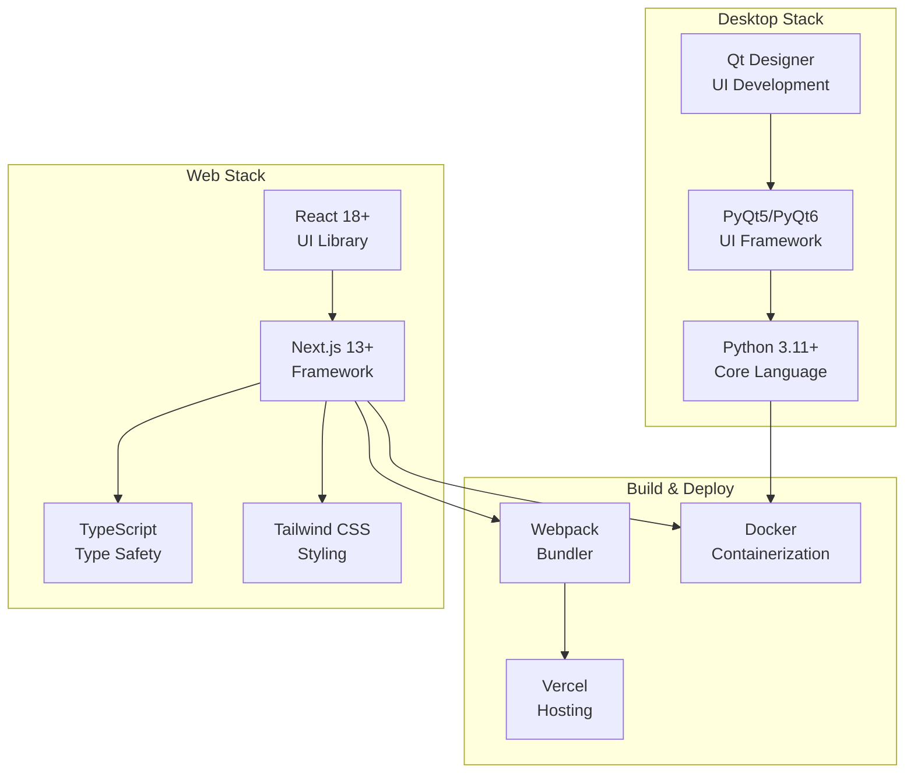

# System Architecture Overview
## Spanish Subjunctive Practice Application

**Last Updated:** October 2, 2025
**Version:** 1.0
**Status:** Active Development

---

## Table of Contents
1. [High-Level Architecture](#high-level-architecture)
2. [Technology Stack](#technology-stack)
3. [Module Dependency Map](#module-dependency-map)
4. [Data Flow Diagrams](#data-flow-diagrams)
5. [Deployment Architecture](#deployment-architecture)
6. [Security Architecture](#security-architecture)

---

## High-Level Architecture

### Multi-Platform Architecture

The application implements a **tri-platform architecture** supporting desktop, web, and API-first access:

### Layered Architecture Pattern

---

## Technology Stack

### Backend Technologies

### Frontend Technologies

### Development & Testing Stack

| Category | Technologies |
|----------|-------------|
| **Testing** | pytest 7.4.3, pytest-asyncio 0.21.1, pytest-mock 3.12.0 |
| **Code Quality** | black 23.11.0, isort 5.12.0, flake8 6.1.0, mypy 1.7.1 |
| **Documentation** | Sphinx, OpenAPI/Swagger, Mermaid |
| **Version Control** | Git, GitHub Actions |
| **Monitoring** | Prometheus, Grafana, Sentry |
| **CI/CD** | GitHub Actions, Docker, Docker Compose |

---

## Module Dependency Map

### Backend Module Dependencies

### Desktop Application Dependencies

### Cross-Platform Shared Dependencies

---

## Data Flow Diagrams

### User Authentication Flow

### Exercise Generation & Submission Flow

### Real-time Progress Tracking

### AI-Enhanced Feedback Flow

---

## Deployment Architecture

### Production Deployment (Docker)

### Container Architecture

---

## Security Architecture

### Security Layers

### Authentication & Authorization Flow

---

## Performance Optimization Architecture

### Caching Strategy

### Async Processing Architecture

---

## Next Steps

1. Review [Architecture Decision Records](./architecture-decision-records/)
2. Consult [Component Catalog](./component-catalog.md)
3. Review [Refactoring Roadmap](/docs/analysis/comprehensive-codebase-analysis.md#10-refactoring-roadmap)
4. Explore [API Documentation](../api/) (when available)

---

**Document Metadata**
- **Created:** October 2, 2025
- **Authors:** Architecture Documentation Agent
- **Review Cycle:** Monthly
- **Related Documents:** ADR-001, ADR-002, ADR-003, Component Catalog
