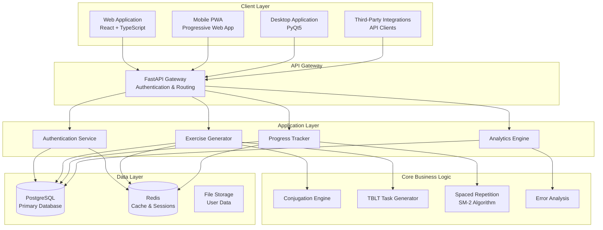
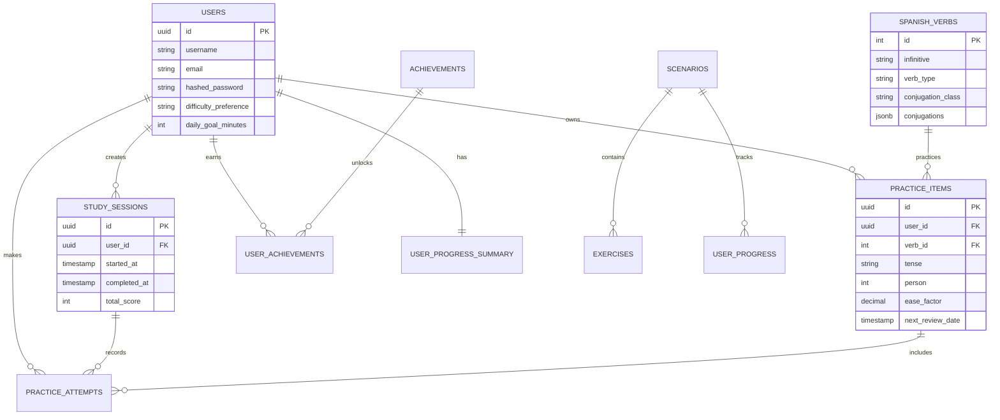
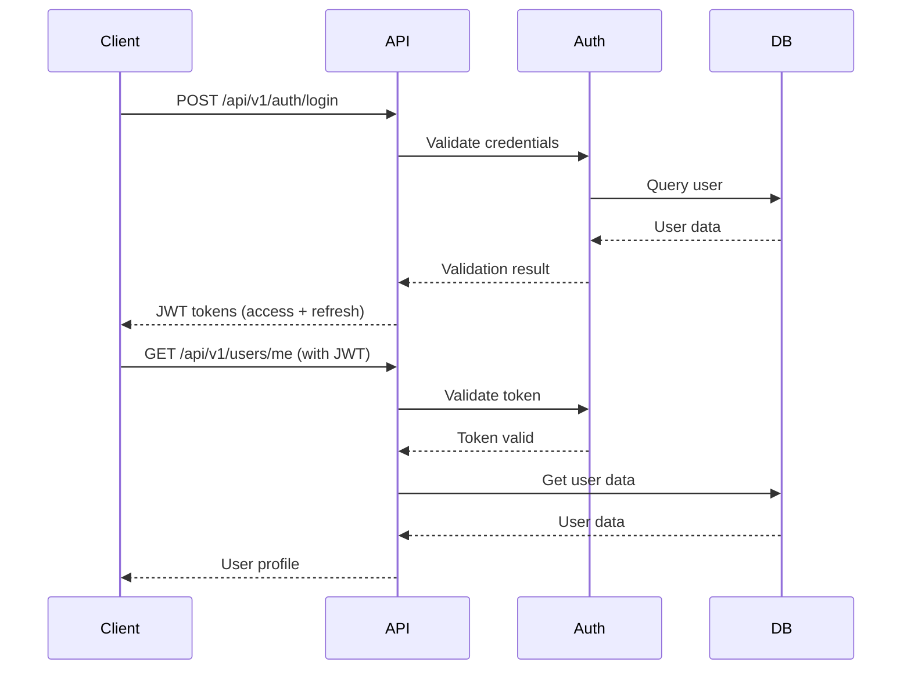
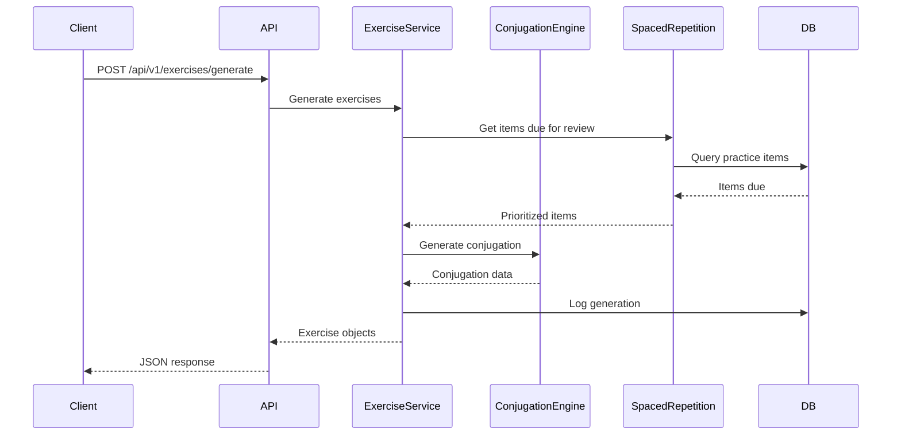

# Architecture Overview

This document provides a comprehensive overview of the Spanish Subjunctive Practice platform architecture, design decisions, and system components.

## System Architecture

### High-Level Architecture



### Component Architecture

#### 1. Backend API (FastAPI)

**Technology Stack**:
- FastAPI 0.100+
- Python 3.8+
- SQLAlchemy 2.0
- Pydantic for validation
- Alembic for migrations

**Key Features**:
- RESTful API design
- Automatic OpenAPI documentation
- JWT authentication
- Rate limiting
- CORS support
- WebSocket support (future)

**File Structure**:
```
backend/
├── api/
│   ├── routes/
│   │   ├── auth.py          # Authentication endpoints
│   │   ├── exercises.py     # Exercise generation
│   │   ├── progress.py      # Progress tracking
│   │   └── analytics.py     # Analytics endpoints
│   └── dependencies.py      # Shared dependencies
├── core/
│   ├── config.py            # Configuration
│   ├── database.py          # Database setup
│   ├── security.py          # Security utilities
│   └── middleware.py        # Custom middleware
├── database/
│   ├── models.py            # SQLAlchemy models
│   ├── seeds.py             # Seed data
│   └── utils.py             # Database utilities
└── services/
    ├── auth_service.py      # Authentication logic
    ├── exercise_service.py  # Exercise generation
    └── progress_service.py  # Progress tracking
```

#### 2. Core Business Logic (JavaScript)

Framework-agnostic JavaScript modules for maximum reusability.

**Modules**:
```
src/core/
├── index.js           # Main orchestrator
├── conjugation.js     # Conjugation rules and validation
├── exercises.js       # TBLT exercise generation
├── progression.js     # Spaced repetition & difficulty
├── analytics.js       # Error analysis & patterns
└── session.js         # Session tracking & review queues
```

**Key Features**:
- Zero dependencies
- Functional programming patterns
- Comprehensive error handling
- Export/import for persistence
- Fully testable

#### 3. Frontend (React)

**Technology Stack**:
- React 18+
- TypeScript 4.5+
- Vite for build tooling
- TailwindCSS for styling
- React Query for data fetching
- Zustand for state management

**Component Structure**:
```
frontend/src/
├── components/
│   ├── ExerciseCard/
│   ├── ProgressDashboard/
│   ├── AnalyticsChart/
│   └── ...
├── pages/
│   ├── Home/
│   ├── Practice/
│   ├── Progress/
│   └── Settings/
├── api/
│   └── client.ts         # API client
├── hooks/
│   ├── useExercises.ts
│   └── useProgress.ts
└── stores/
    └── userStore.ts
```

#### 4. Desktop Application (PyQt5)

Cross-platform desktop application with native OS integration.

**Features**:
- Offline-first design
- Local data persistence
- Native system tray
- Keyboard shortcuts
- Theme support

## Database Schema

### Core Tables

#### Users Table
```sql
CREATE TABLE users (
    id UUID PRIMARY KEY DEFAULT gen_random_uuid(),
    username VARCHAR(50) UNIQUE NOT NULL,
    email VARCHAR(255) UNIQUE NOT NULL,
    hashed_password VARCHAR(255) NOT NULL,

    -- Profile
    first_name VARCHAR(50),
    last_name VARCHAR(50),
    avatar_url VARCHAR(255),

    -- Status
    is_verified BOOLEAN DEFAULT FALSE,
    is_premium BOOLEAN DEFAULT FALSE,

    -- Settings
    language_preference VARCHAR(10) DEFAULT 'en',
    difficulty_preference VARCHAR(20) DEFAULT 'intermediate',
    daily_goal_minutes INTEGER DEFAULT 30,

    -- Timestamps
    created_at TIMESTAMP WITH TIME ZONE DEFAULT NOW(),
    updated_at TIMESTAMP WITH TIME ZONE DEFAULT NOW(),
    last_login TIMESTAMP WITH TIME ZONE
);
```

#### Spanish Verbs Table
```sql
CREATE TABLE spanish_verbs (
    id SERIAL PRIMARY KEY,
    infinitive VARCHAR(50) UNIQUE NOT NULL,
    english_translation VARCHAR(200) NOT NULL,

    -- Classification
    verb_type VARCHAR(20) NOT NULL,
    conjugation_class VARCHAR(10) NOT NULL,
    stem_change_pattern VARCHAR(20),

    -- Learning metadata
    frequency_rank INTEGER,
    difficulty_level VARCHAR(20) DEFAULT 'intermediate',

    -- JSON data
    conjugations JSONB DEFAULT '{}',
    example_sentences JSONB DEFAULT '[]',
    semantic_tags JSONB DEFAULT '[]',

    created_at TIMESTAMP WITH TIME ZONE DEFAULT NOW()
);
```

#### Practice Items Table (Spaced Repetition)
```sql
CREATE TABLE practice_items (
    id UUID PRIMARY KEY DEFAULT gen_random_uuid(),
    user_id UUID NOT NULL REFERENCES users(id) ON DELETE CASCADE,
    verb_id INTEGER NOT NULL REFERENCES spanish_verbs(id),

    -- Practice context
    tense VARCHAR(50) NOT NULL,
    person INTEGER NOT NULL,
    category VARCHAR(30) NOT NULL,
    trigger_phrase VARCHAR(100) NOT NULL,

    -- SM-2 Algorithm data
    attempts INTEGER DEFAULT 0,
    correct_attempts INTEGER DEFAULT 0,
    current_interval INTEGER DEFAULT 0,  -- Days
    ease_factor DECIMAL(3,2) DEFAULT 2.5,
    next_review_date TIMESTAMP WITH TIME ZONE DEFAULT NOW(),
    last_reviewed TIMESTAMP WITH TIME ZONE,

    -- Performance metrics
    average_response_time DECIMAL(6,2),
    mastery_level DECIMAL(3,2) DEFAULT 0.0,

    -- Analytics
    error_patterns JSONB DEFAULT '[]',
    strengths JSONB DEFAULT '[]',

    created_at TIMESTAMP WITH TIME ZONE DEFAULT NOW(),
    updated_at TIMESTAMP WITH TIME ZONE DEFAULT NOW(),

    CONSTRAINT unique_practice_item
        UNIQUE(user_id, verb_id, tense, person, category)
);
```

#### Study Sessions Table
```sql
CREATE TABLE study_sessions (
    id UUID PRIMARY KEY DEFAULT gen_random_uuid(),
    user_id UUID NOT NULL REFERENCES users(id) ON DELETE CASCADE,

    -- Timing
    started_at TIMESTAMP WITH TIME ZONE NOT NULL DEFAULT NOW(),
    completed_at TIMESTAMP WITH TIME ZONE,
    total_time_seconds INTEGER DEFAULT 0,

    -- Performance
    total_score INTEGER DEFAULT 0,
    total_possible_score INTEGER DEFAULT 0,
    exercises_completed INTEGER DEFAULT 0,

    -- Session type
    session_type VARCHAR(20) DEFAULT 'practice',
    difficulty_level VARCHAR(20),

    -- Goals & achievements
    daily_goal_met BOOLEAN DEFAULT FALSE,
    streak_day INTEGER DEFAULT 1,
    achievements_unlocked JSONB DEFAULT '[]',

    -- Analytics
    concepts_practiced JSONB DEFAULT '[]',
    weak_areas_identified JSONB DEFAULT '[]'
);
```

### Entity Relationship Diagram



## API Design

### RESTful Principles

All endpoints follow REST conventions:

- **GET**: Retrieve resources
- **POST**: Create new resources
- **PUT**: Update entire resources
- **PATCH**: Partial updates
- **DELETE**: Remove resources

### Authentication Flow



### Exercise Generation Flow



## Core Algorithms

### 1. Spaced Repetition (SM-2)

The platform uses the SuperMemo 2 algorithm for optimal review scheduling:

```javascript
function calculateNextReview(item, quality) {
  // quality: 0-5 (0 = total blackout, 5 = perfect response)

  if (quality < 3) {
    // Incorrect answer - reset interval
    item.interval = 1;
    item.repetitions = 0;
  } else {
    // Correct answer - increase interval
    if (item.repetitions === 0) {
      item.interval = 1;
    } else if (item.repetitions === 1) {
      item.interval = 6;
    } else {
      item.interval = Math.round(item.interval * item.easeFactor);
    }
    item.repetitions += 1;
  }

  // Adjust ease factor
  item.easeFactor = Math.max(1.3,
    item.easeFactor + (0.1 - (5 - quality) * (0.08 + (5 - quality) * 0.02))
  );

  // Calculate next review date
  item.nextReview = new Date(Date.now() + item.interval * 86400000);

  return item;
}
```

### 2. Adaptive Difficulty

Dynamic difficulty adjustment based on performance:

```javascript
function adjustDifficulty(session) {
  const accuracy = session.correctAnswers / session.totalAnswers;
  const avgResponseTime = session.totalResponseTime / session.totalAnswers;

  if (accuracy > 0.85 && avgResponseTime < 3000) {
    return increaseDifficulty(session.currentDifficulty);
  } else if (accuracy < 0.60 || avgResponseTime > 8000) {
    return decreaseDifficulty(session.currentDifficulty);
  }

  return session.currentDifficulty;
}
```

### 3. Error Pattern Recognition

Intelligent error categorization:

```javascript
function categorizeError(userAnswer, correctAnswer, context) {
  const errors = [];

  // Mood confusion (indicative vs subjunctive)
  if (isIndicative(userAnswer) && isSubjunctive(correctAnswer)) {
    errors.push({ type: 'mood_confusion', severity: 'high' });
  }

  // Tense errors
  if (getTense(userAnswer) !== getTense(correctAnswer)) {
    errors.push({ type: 'tense_error', severity: 'medium' });
  }

  // Accent marks
  if (removeAccents(userAnswer) === removeAccents(correctAnswer)) {
    errors.push({ type: 'accent_mark', severity: 'low' });
  }

  // Stem-changing errors
  if (context.verb.hasStemChange && !appliesStemChange(userAnswer)) {
    errors.push({ type: 'stem_change', severity: 'high' });
  }

  return errors;
}
```

## Security Architecture

### Authentication & Authorization

- **JWT Tokens**: Stateless authentication
- **Refresh Tokens**: Long-lived tokens for re-authentication
- **Password Hashing**: bcrypt with configurable rounds
- **CORS**: Configurable allowed origins
- **Rate Limiting**: Redis-based rate limiting

### Data Protection

- **Encryption at Rest**: PostgreSQL encryption
- **Encryption in Transit**: TLS/SSL for all connections
- **Input Validation**: Pydantic models for all inputs
- **SQL Injection Prevention**: SQLAlchemy ORM
- **XSS Protection**: Content Security Policy headers

## Performance Optimization

### Caching Strategy

```
┌─────────────┐
│   Request   │
└──────┬──────┘
       │
       ▼
┌─────────────┐
│ Redis Cache │  ◄─── Check cache first
└──────┬──────┘
       │ (miss)
       ▼
┌─────────────┐
│  Database   │  ◄─── Query if cache miss
└──────┬──────┘
       │
       ▼
┌─────────────┐
│Update Cache │  ◄─── Store in cache
└─────────────┘
```

**Cached Data**:
- User sessions (TTL: 30 minutes)
- Exercise templates (TTL: 1 hour)
- Verb conjugations (TTL: 24 hours)
- Progress statistics (TTL: 5 minutes)

### Database Optimization

- **Indexes**: On frequently queried fields
- **Connection Pooling**: 10 connections by default
- **Query Optimization**: Eager loading for relationships
- **Partitioning**: Large tables partitioned by date

## Deployment Architecture

### Production Setup

```
┌─────────────────────────────────────────────┐
│            Load Balancer (Nginx)             │
└───────────────┬─────────────────────────────┘
                │
    ┌───────────┴───────────┐
    │                       │
    ▼                       ▼
┌─────────┐           ┌─────────┐
│  API    │           │  API    │
│ Server  │           │ Server  │
│   #1    │           │   #2    │
└────┬────┘           └────┬────┘
     │                     │
     └──────────┬──────────┘
                │
    ┌───────────┴───────────┐
    │                       │
    ▼                       ▼
┌─────────┐           ┌─────────┐
│ Primary │◄─────────►│ Replica │
│   DB    │  Streaming│   DB    │
└─────────┘  Replica  └─────────┘
    │
    ▼
┌─────────┐
│  Redis  │
│ Cluster │
└─────────┘
```

### Scaling Strategy

**Horizontal Scaling**:
- Stateless API servers
- Database read replicas
- Redis cluster mode

**Vertical Scaling**:
- Increase server resources
- Optimize database queries
- Tune connection pools

## Monitoring & Observability

### Metrics Collected

- **Performance**: Response times, throughput
- **Errors**: Error rates, stack traces
- **Business**: User engagement, learning progress
- **Infrastructure**: CPU, memory, disk usage

### Logging Strategy

```python
# Structured logging
logger.info("Exercise generated", extra={
    "user_id": user.id,
    "difficulty": difficulty,
    "tense": tense,
    "response_time_ms": 45
})
```

## Design Decisions

See [Architecture Decision Records](../architecture/ARCHITECTURE_DECISION_RECORDS.md) for detailed rationale on:

- Choice of FastAPI over Flask
- PostgreSQL vs MongoDB
- Spaced repetition algorithm selection
- Frontend framework selection
- Desktop vs Web-first approach

---

**Next**: [API Reference](./api-reference.md) →
