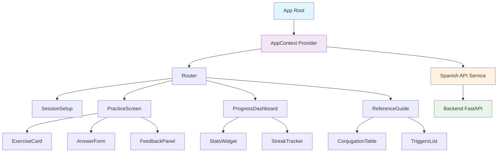

# Component Interaction Diagram
## Spanish Subjunctive Practice React Frontend

*Data Flow and Component Communication Patterns*

---

## 📊 Component Data Flow Diagram



---

## 🔄 State Management Flow

### Context Provider Pattern
```jsx
// AppContext.jsx - Central state management
const AppContext = createContext();

export const AppProvider = ({ children }) => {
  // Session State
  const [session, setSession] = useState(null);
  const [currentExercise, setCurrentExercise] = useState(null);
  
  // Progress State  
  const [progress, setProgress] = useState({
    totalCorrect: 0,
    totalAttempts: 0,
    currentStreak: 0,
    masteryLevels: {}
  });
  
  // UI State
  const [loading, setLoading] = useState(false);
  const [error, setError] = useState(null);
  
  // Actions
  const actions = {
    createSession: async (userId) => {
      setLoading(true);
      try {
        const newSession = await spanishApi.createSession(userId);
        setSession(newSession);
        setError(null);
      } catch (err) {
        setError('Failed to create session');
      } finally {
        setLoading(false);
      }
    },
    
    generateExercise: async (difficulty, category) => {
      setLoading(true);
      try {
        const exercise = await spanishApi.generatePractice(difficulty, category);
        setCurrentExercise(exercise);
        setError(null);
      } catch (err) {
        setError('Failed to load exercise');
      } finally {
        setLoading(false);
      }
    },
    
    submitAnswer: async (taskId, answer, responseTime) => {
      try {
        const result = await spanishApi.submitAnswer(taskId, answer, responseTime);
        
        // Update progress
        setProgress(prev => ({
          ...prev,
          totalAttempts: prev.totalAttempts + 1,
          totalCorrect: result.correct ? prev.totalCorrect + 1 : prev.totalCorrect,
          currentStreak: result.streak
        }));
        
        return result;
      } catch (err) {
        setError('Failed to submit answer');
        throw err;
      }
    }
  };
  
  return (
    <AppContext.Provider value={{
      // State
      session,
      currentExercise, 
      progress,
      loading,
      error,
      // Actions
      ...actions
    }}>
      {children}
    </AppContext.Provider>
  );
};

export const useAppContext = () => {
  const context = useContext(AppContext);
  if (!context) {
    throw new Error('useAppContext must be used within AppProvider');
  }
  return context;
};
```

---

## 🧩 Component Communication Patterns

### 1. Parent-Child Communication (Props Down)

```jsx
// PracticeScreen.jsx - Parent component
const PracticeScreen = () => {
  const { currentExercise, loading, error } = useAppContext();
  const [userAnswer, setUserAnswer] = useState('');
  const [feedback, setFeedback] = useState(null);
  
  const handleAnswerSubmit = async (answer, responseTime) => {
    const result = await submitAnswer(
      currentExercise.taskId, 
      answer, 
      responseTime
    );
    setFeedback(result);
  };
  
  if (loading) return <LoadingSpinner />;
  if (error) return <ErrorMessage error={error} />;
  if (!currentExercise) return <NoExerciseMessage />;
  
  return (
    <div className="practice-screen">
      <ExerciseCard 
        exercise={currentExercise}
        disabled={!!feedback}
      />
      
      <AnswerForm 
        onSubmit={handleAnswerSubmit}
        disabled={loading || !!feedback}
        placeholder="Type your answer here..."
      />
      
      {feedback && (
        <FeedbackPanel 
          feedback={feedback}
          onNext={() => {
            setFeedback(null);
            generateExercise();
          }}
        />
      )}
    </div>
  );
};
```

### 2. Child-Parent Communication (Events Up)

```jsx
// AnswerForm.jsx - Child component
const AnswerForm = ({ onSubmit, disabled, placeholder }) => {
  const [answer, setAnswer] = useState('');
  const [startTime] = useState(Date.now());
  
  const handleSubmit = (e) => {
    e.preventDefault();
    if (!answer.trim()) return;
    
    const responseTime = Date.now() - startTime;
    onSubmit(answer.trim(), responseTime);
    setAnswer('');
  };
  
  return (
    <form onSubmit={handleSubmit} className="answer-form">
      <label htmlFor="answer-input" className="sr-only">
        Type your answer
      </label>
      <input
        id="answer-input"
        type="text"
        value={answer}
        onChange={(e) => setAnswer(e.target.value)}
        placeholder={placeholder}
        disabled={disabled}
        autoFocus
        aria-describedby="answer-hint"
      />
      <button 
        type="submit" 
        disabled={disabled || !answer.trim()}
        aria-label="Submit answer"
      >
        Submit
      </button>
    </form>
  );
};
```

### 3. Sibling Communication (Context/State)

```jsx
// ProgressDashboard.jsx - Uses shared context
const ProgressDashboard = () => {
  const { progress, session } = useAppContext();
  
  return (
    <div className="progress-dashboard">
      <StatsWidget 
        correct={progress.totalCorrect}
        total={progress.totalAttempts}
        accuracy={progress.totalCorrect / progress.totalAttempts * 100}
      />
      
      <StreakTracker 
        currentStreak={progress.currentStreak}
        bestStreak={session?.bestStreak || 0}
      />
    </div>
  );
};

// StatsWidget.jsx - Receives data via props
const StatsWidget = ({ correct, total, accuracy }) => {
  return (
    <div className="stats-widget">
      <div className="stat">
        <span className="stat-value">{correct}</span>
        <span className="stat-label">Correct</span>
      </div>
      <div className="stat">
        <span className="stat-value">{total}</span>
        <span className="stat-label">Total</span>
      </div>
      <div className="stat">
        <span className="stat-value">{Math.round(accuracy)}%</span>
        <span className="stat-label">Accuracy</span>
      </div>
    </div>
  );
};
```

---

## 🔌 API Integration Patterns

### Service Layer Architecture

```jsx
// services/spanishApi.js
class SpanishApi {
  constructor() {
    this.baseUrl = process.env.REACT_APP_API_URL || 'http://localhost:8000';
    this.session = null;
  }
  
  // Session Management
  async createSession(userId = null) {
    const response = await this.request('POST', '/api/session/create', {
      user_id: userId
    });
    this.session = response;
    return response;
  }
  
  // Exercise Generation with caching
  async generatePractice(difficulty = 2, category = null) {
    const cacheKey = `exercise-${difficulty}-${category}`;
    const cached = this.getFromCache(cacheKey);
    
    if (cached && !this.isExpired(cached)) {
      return cached.data;
    }
    
    const response = await this.request('GET', '/api/practice/generate', {
      difficulty,
      category,
      session_id: this.session?.session_id
    });
    
    this.setCache(cacheKey, response, 300000); // 5 minutes
    return response;
  }
  
  // Answer submission with retry logic
  async submitAnswer(taskId, answer, responseTime) {
    return this.request('POST', '/api/practice/submit', {
      task_id: taskId,
      session_id: this.session.session_id,
      answer: answer,
      response_time: responseTime
    });
  }
  
  // Progress tracking
  async getProgress() {
    if (!this.session) throw new Error('No active session');
    
    return this.request('GET', `/api/progress/${this.session.session_id}`);
  }
  
  // Reference data
  async getConjugation(verb, tense = 'present_subjunctive') {
    return this.request('GET', `/api/conjugate/${verb}`, { tense });
  }
  
  async getSubjunctiveTriggers() {
    return this.request('GET', '/api/reference/triggers');
  }
  
  // Base request method with error handling
  async request(method, endpoint, data = null) {
    const url = `${this.baseUrl}${endpoint}`;
    const config = {
      method,
      headers: {
        'Content-Type': 'application/json',
      },
    };
    
    if (data) {
      if (method === 'GET') {
        const params = new URLSearchParams(data);
        url += `?${params}`;
      } else {
        config.body = JSON.stringify(data);
      }
    }
    
    try {
      const response = await fetch(url, config);
      
      if (!response.ok) {
        throw new Error(`HTTP ${response.status}: ${response.statusText}`);
      }
      
      return await response.json();
    } catch (error) {
      // Transform technical errors into user-friendly messages
      if (error.name === 'TypeError') {
        throw new Error('Unable to connect. Please check your internet connection.');
      }
      
      if (error.message.includes('500')) {
        throw new Error('Server error. Please try again in a moment.');
      }
      
      if (error.message.includes('400')) {
        throw new Error('Invalid request. Please check your input.');
      }
      
      throw error;
    }
  }
  
  // Simple caching mechanism
  cache = new Map();
  
  getFromCache(key) {
    return this.cache.get(key);
  }
  
  setCache(key, data, ttl) {
    this.cache.set(key, {
      data,
      timestamp: Date.now(),
      ttl
    });
  }
  
  isExpired(cached) {
    return Date.now() - cached.timestamp > cached.ttl;
  }
}

export default new SpanishApi();
```

---

## 🔄 Custom Hooks for Component Logic

### useExercise Hook
```jsx
// hooks/useExercise.js
export const useExercise = () => {
  const { currentExercise, generateExercise, submitAnswer } = useAppContext();
  const [feedback, setFeedback] = useState(null);
  const [isSubmitting, setIsSubmitting] = useState(false);
  
  const handleSubmit = async (answer, responseTime) => {
    setIsSubmitting(true);
    try {
      const result = await submitAnswer(
        currentExercise.task_id, 
        answer, 
        responseTime
      );
      setFeedback(result);
    } catch (error) {
      setFeedback({
        correct: false,
        feedback: 'Unable to submit answer. Please try again.',
        error: true
      });
    } finally {
      setIsSubmitting(false);
    }
  };
  
  const nextExercise = () => {
    setFeedback(null);
    generateExercise();
  };
  
  return {
    currentExercise,
    feedback,
    isSubmitting,
    handleSubmit,
    nextExercise
  };
};
```

### useProgress Hook
```jsx
// hooks/useProgress.js
export const useProgress = () => {
  const { progress, session } = useAppContext();
  const [progressData, setProgressData] = useState(null);
  
  useEffect(() => {
    const loadProgress = async () => {
      try {
        const data = await spanishApi.getProgress();
        setProgressData(data);
      } catch (error) {
        console.error('Failed to load progress:', error);
      }
    };
    
    if (session) {
      loadProgress();
    }
  }, [session]);
  
  const getAccuracy = () => {
    if (progress.totalAttempts === 0) return 0;
    return (progress.totalCorrect / progress.totalAttempts * 100).toFixed(1);
  };
  
  const getStreakMessage = () => {
    const streak = progress.currentStreak;
    if (streak === 0) return "Start your streak!";
    if (streak < 5) return `${streak} in a row - keep going!`;
    if (streak < 10) return `${streak} streak - you're on fire!`;
    return `Amazing ${streak} streak!`;
  };
  
  return {
    progress,
    progressData,
    accuracy: getAccuracy(),
    streakMessage: getStreakMessage()
  };
};
```

---

## 🎯 Event Flow Examples

### Exercise Submission Flow
```
1. User types answer in AnswerForm
2. User clicks Submit or presses Enter
3. AnswerForm validates input locally
4. AnswerForm calls onSubmit prop with answer + response time
5. PracticeScreen receives event, calls submitAnswer from context
6. AppContext action makes API call to backend
7. Backend validates answer and returns feedback
8. AppContext updates progress state
9. PracticeScreen receives result and updates feedback state
10. FeedbackPanel renders with result
11. User clicks Next, triggering next exercise generation
```

### Session Creation Flow
```
1. User opens app, lands on SessionSetup
2. User selects preferences (difficulty, category)
3. User clicks "Start Practice"
4. SessionSetup calls createSession from context
5. AppContext makes API call to create session
6. Backend creates session and returns session data
7. AppContext stores session data
8. Router automatically navigates to PracticeScreen
9. PracticeScreen requests first exercise
10. Exercise loads and practice begins
```

---

## 📱 Responsive Component Behavior

### Mobile Adaptations
```jsx
// hooks/useResponsive.js
export const useResponsive = () => {
  const [isMobile, setIsMobile] = useState(window.innerWidth < 768);
  
  useEffect(() => {
    const handleResize = () => {
      setIsMobile(window.innerWidth < 768);
    };
    
    window.addEventListener('resize', handleResize);
    return () => window.removeEventListener('resize', handleResize);
  }, []);
  
  return { isMobile };
};

// ExerciseCard.jsx - Responsive behavior
const ExerciseCard = ({ exercise, disabled }) => {
  const { isMobile } = useResponsive();
  
  return (
    <div className={`exercise-card ${isMobile ? 'mobile' : 'desktop'}`}>
      <div className="context">
        <h2>{exercise.context}</h2>
        {!isMobile && <div className="category-badge">{exercise.category}</div>}
      </div>
      
      <div className="prompt">
        <p>{exercise.prompt}</p>
        {exercise.hint && (
          <details className="hint">
            <summary>Need a hint?</summary>
            <p>{exercise.hint}</p>
          </details>
        )}
      </div>
    </div>
  );
};
```

This component interaction design ensures clean data flow, proper separation of concerns, and educational effectiveness while maintaining performance and accessibility standards.